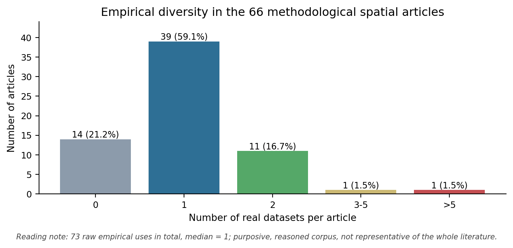
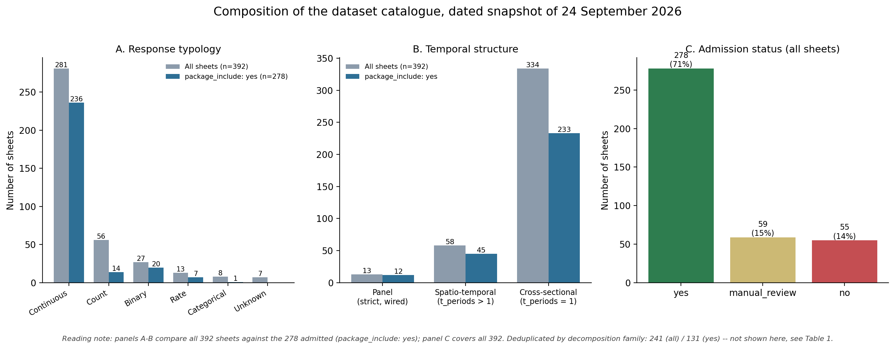
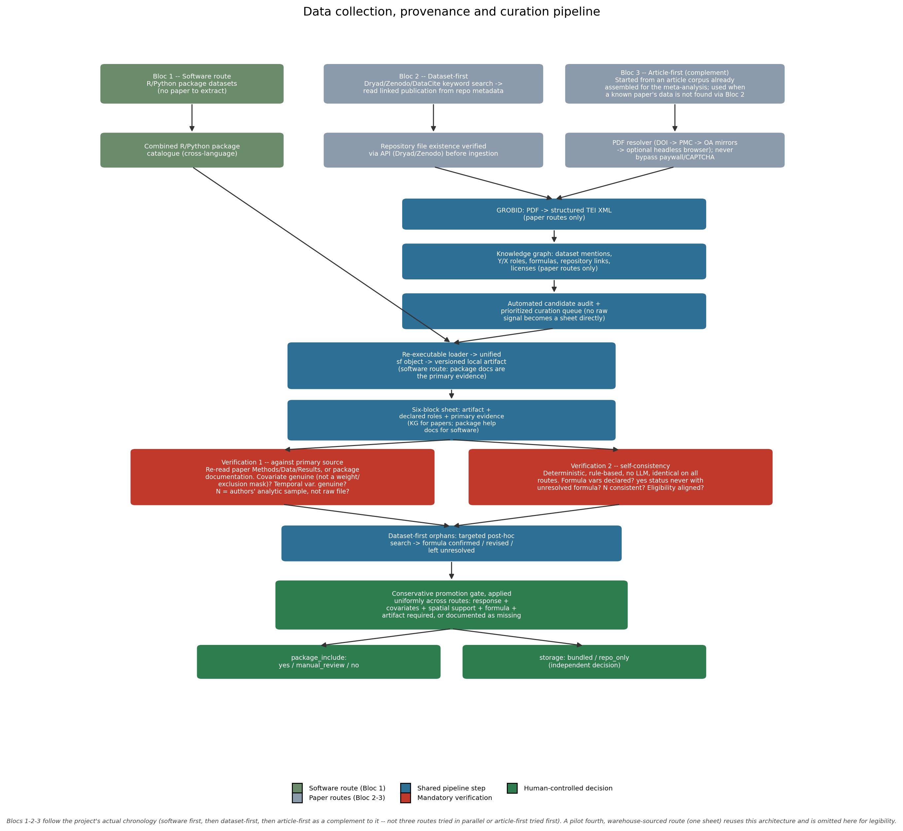

# Working draft: spatial and spatio-temporal data bank

Status: working manuscript, updated 24 September 2026 from the dated repository snapshot generated by `tools/audit_datapaper_repo.py`. Citation keys remain to be aligned with the master bibliography.

## Working title

**A provenance-aware, cross-domain data bank of spatial and spatio-temporal datasets for reproducible statistical research**

## Background & Summary

### Monte Carlo breadth and empirical breadth

Simulation is central to the development of spatial estimators because it provides a known data-generating process and allows individual sources of difficulty to be varied under controlled conditions. Spatial dependence, sample size, neighborhood geometry or the spatial weights matrix, covariance range, signal-to-noise ratio, error distributions, heteroskedasticity and coefficient nonstationarity can therefore be studied separately or in factorial designs. This strategy underpins influential work across spatial econometrics, geographically weighted regression, geostatistics and spatial panel models. Representative contributions include generalized-moments estimation for spatial autoregression1, covariance tapering2, predictive-process approximations3 and spatially correlated panel error components4. Simulation nevertheless answers a conditional question: how a method behaves under the chosen mechanisms and parameter values. It does not by itself establish that the same conclusions hold across empirical domains, spatial supports or measurement processes.

To examine how empirical evidence complements simulation in this literature, we coded a deliberately diversified sample of methodological articles covering spatial econometrics; geographically weighted, multiscale and spatially varying coefficient models; geostatistics and Gaussian processes; spatial panels and spatio-temporal models; and complementary developments in spatial testing, clustering, change of support, geoadditive modeling and predictive synthesis. The quantitative sample contains 66 fully screened articles with an explicit parametric data-generating process and an eligible methodological evaluation. Two foundational GWR papers based on randomization, one theory paper without Monte Carlo evaluation and one simulation paper without a real-data application are retained as separate screening records outside this denominator. The resulting sample is designed to compare evaluation practices across methodological families; it is not an estimate of the prevalence of these practices in the whole spatial-statistics literature.

Empirical breadth remained concentrated within individual articles (Figure 1). Fourteen of the 66 articles used no real dataset (21.2%), 39 used one (59.1%), 11 used two (16.7%), one used five (1.5%) and one used seven (1.5%). The median was one real dataset per article. The corpus contained 73 empirical uses and 63 harmonized real-data sources. Boston Housing appeared in four articles and Dublin Voter in three; NCDC precipitation, USDA-FIA biomass, HECM originations, US cigarette demand and the Meuse data each appeared in two. Twenty articles (30.3%) included an identifiable out-of-sample evaluation, 45 remained focused on estimation, inference, parameter recovery or in-sample fit, and one case remained unclear.

**Figure 1.** Distribution of the number of real datasets used per article across the 66-article parametric-DGP sample (median 1; 73 raw empirical uses in total). This is a purposive, reasoned corpus. It is not representative of the whole spatial-statistics literature.

The simulation designs were substantially broader in a descriptive sense. The 66 articles contained at least 117 distinct simulation experiments and at least 141 named DGP structures. The latter count is deliberately conservative and descriptive, because the meaning of a structure varies across articles. Exact or exactly reconstructible principal designs were available for 36 articles and contributed 1,898 cells. Documented lower bounds from 15 further articles contributed 144 more. Together they yielded a conservative minimum of 2,042 parameter cells. The remaining 15 articles used continuous parameter ranges, graphical grids, dispersed tables or designs whose complete factorial size was not reported. These figures should not be interpreted as a ratio between equivalent units. A parameter cell and a real dataset answer different scientific questions. They show that evaluation effort was commonly distributed across many controlled synthetic settings, while empirical diversity within individual articles remained narrow.

This pattern motivates a complementary research infrastructure. Methodological simulation remains indispensable for isolating mechanisms and checking statistical properties, but broader empirical coverage is needed to assess how conclusions vary across domains, supports, sample sizes, spatial configurations, temporal structures and data-quality conditions. A reusable spatial data bank can reduce the cost of assembling that evidence, provided that it preserves the information required to understand each dataset rather than treating datasets as interchangeable tables. The resource presented here therefore links data to their provenance, published analytical roles and formulas, spatial and temporal structure, available geometries and spatial weights, local artifacts, transformations, limitations and readiness for reuse. It also retains controlled derivatives and semi-synthetic records that connect known data-generating mechanisms to real spatial supports.

### Existing collections and the remaining gap

General-purpose benchmarking infrastructures provide useful but distinct precedents. PMLB standardizes access to a broad collection of tabular datasets through common interfaces and machine-readable metadata5. OpenML goes further by distinguishing a dataset from a benchmark task, in which a target, evaluation procedure, fixed splits and metric are specified, and from the runs produced by applying computational pipelines to that task6. AMLB focuses on the execution layer, recording software environments, budgets, predictions, scores, warnings and failures so that an AutoML comparison can be reproduced and audited7. Together, these resources show that a collection of datasets, a versioned suite of statistical tasks and an execution harness are related infrastructure components rather than interchangeable labels.

Recent tabular benchmarks also show that evaluation design carries substantive meaning. TableShift defines shifts between training and target domains instead of treating the split as a purely computational choice8. TabZilla compares diverse model families over many datasets and demonstrates the value of strong baselines and empirical measures of task difficulty9. TabReD preserves richer feature sets and temporal splits drawn from realistic applications, showing that simplified variables or random splits can alter comparative conclusions10. These lessons are directly relevant to spatial data: random train–test partitions, interpolation within a sampled region, extrapolation to a new territory and temporal forecasting define different target populations and should not be collapsed into a single validation label.

Well-documented spatial data banks already exist, particularly in hydrology. CAMELS-US links hydroclimatic time series to catchment attributes for 671 basins and documents sources, units, derivations and known limitations11. LamaH-CE extends this model to 859 basins across nine countries, multiple temporal resolutions and explicit river-network relationships12. Caravan harmonizes several regional resources into a reproducible global collection of 6,830 catchments while retaining geometric quality indicators and an extensible processing workflow13. These resources demonstrate that spatial provenance and variable-level documentation can be handled rigorously at scale. Their scientific coherence is also a strength: each collection is organized around a shared hydrological unit, a closely related set of variables and a common family of uses.

Table 2 positions these precedents against the present resource along the dimensions discussed above.

**Table 2. Feature comparison with precedent benchmarking and data-bank infrastructures.** "Task/suite/run separated" marks resources that version a computational task and its execution independently from the raw dataset. "Spatial relational structure" distinguishes a true spatial-econometric weights matrix from a river-network topology, which serves a related but distinct purpose (flow routing, not a general neighborhood/dependence structure) and is not interchangeable with it.

| Resource | Scope | Task/suite/run separated | Spatial relational structure | Temporal/panel structure | Published formula linked to record | Reported scale |
|---|---|---|---|---|---|---|
| PMLB | Multi-domain, general ML | No | No | No | No | Aggregated public collection (size not fixed by design) |
| OpenML-CC18 suites | Multi-domain, general ML | Yes (dataset / task / run) | No | Partial (time-series tasks exist) | No | Curated classification suite |
| AMLB | Multi-domain (execution layer only) | Yes (execution/reporting layer) | No | No | No | 104 tasks (71 classification + 33 regression) |
| TableShift | Multi-domain, general ML | Yes (shift-defined tasks) | No | No | No | 15 binary classification tasks |
| TabZilla | Multi-domain, general ML | Partial (benchmark subset released) | No | No | No | 176 datasets studied; 36-dataset suite released |
| TabReD | Multi-domain, general ML | Partial (fixed time-based splits) | No | Yes (time-based splits) | No | 8 industry-grade datasets |
| CAMELS-US | Single domain (US hydrology) | No | River network (not a general W) | Yes (time series) | No | 671 basins |
| LamaH-CE | Single domain (Central European hydrology) | No | River network (not a general W) | Yes (time series) | No | 859 basins, 9 countries |
| Caravan | Single domain (global hydrology) | No | River network (not a general W) | Yes (time series) | No | 6,830 catchments |
| This bank | Multi-domain, spatial and spatio-temporal | Planned (dataset / task / suite / run schema, Sect. Contribution) | Yes (recorded spatial weights, when available) | Yes (panel structure and parent-derivative links) | Yes (`formula_pub`/`formula_used`, verified against source) | 392 sheets; 278 admitted; 131 deduplicated admitted families |

The remaining need is therefore more specific than the absence of spatial repositories. General benchmark platforms usually do not preserve the spatial objects, neighborhood structures, coordinate reference systems, temporal panels and published spatial formulas required to reconstruct a spatial analysis. Conversely, mature domain resources are not intended to connect heterogeneous areal, point, network, raster and spatio-temporal datasets across epidemiology, ecology, environmental science, regional science, housing and other fields. The present data bank addresses this multidomain layer. It treats the source dataset, local artifact, documented analytical record, controlled derivative and future benchmark task as separate linked objects, while recording provenance, response and covariate roles, published formulas, geometry, time and spatial weights. This scope complements existing collections rather than replacing them.

### From dispersed sources to reusable spatial records

Spatial datasets suitable for methodological research are already distributed through software packages, article supplements, institutional repositories and domain portals. Their availability as files does not, however, make them immediately reusable as analytical records. The response and predictor roles may be implicit in an article, coordinates may lack a declared reference system, polygon geometry may be separated from attributes, temporal identifiers may have been removed from a published cross-section, and the spatial weights or formula used by the authors may be unavailable. Versions, licenses and transformations also differ across sources. The practical problem addressed here is therefore not simply data discovery, but the preservation of the information needed to reconstruct and assess a spatial analysis.

The repository snapshot dated 24 September 2026 contains 392 dataset sheets and 392 corresponding registry entries, with complete identifier alignment and no disagreement among the non-empty fields checked by the audit. Of the sheets, 280 describe publication-linked records collected through the article-first and dataset-first routes, 111 originate from the software route documented directly from R and Python spatial-modeling packages, and one is a pilot warehouse-sourced record from a fourth, not yet generalized, route that reuses the same architecture. All 392 registry entries point to a local artifact, and all contain a `formula_used` field. Of these formulas, 354 are resolved rather than marked `pending`. These are documentation and availability counts, not counts of independent sources or completed benchmark runs.

The registry classifies 278 entries as `package_include: yes`, 59 as `manual_review` and 55 as `no`. Because some parent datasets were divided into reproducible spatial or temporal children, the 392 sheets correspond to 241 deduplicated dataset families in the full catalogue. Within the `yes` population, 278 registry entries correspond to 131 deduplicated families. The distinction is substantive. A yearly slice and its retained panel parent are useful analytical objects, but they should not be presented as independent empirical sources.

`package_include: yes` denotes current inclusion in the package's dataset registry and readiness for the estimation harness. It is deliberately independent from physical distribution and from benchmark usage, which are tracked separately. A `yes` entry is marked `benchmark_ready` only when its readiness status is additionally `ready` rather than merely admitted (276 of the 278 currently satisfy both). It does not imply that the dataset has actually been used in a comparative benchmark run.

Nor does `yes` imply that the artifact ships inside the installed package. Of the 278, only 16 are physically bundled with the package (`storage: bundled`). These are a mix of small classical datasets already distributed with comparable R packages (e.g. Boston Housing, Columbus, Georgia, Dublin Voter) and a handful of publication-derived records selected for bundling. The remaining 262 are retrieved from the versioned repository at load time (`storage: repo_only`). This distinction between catalogue admission, physical bundling and redistribution rights is detailed in Usage Notes.

The snapshot includes 58 records with more than one observed period and 13 records explicitly wired as spatial panels. Forty-five of the `yes` entries have more than one period, of which 12 are explicitly represented as spatial panels. This difference reflects the conservative policy used in the project: a free-text indication of temporal structure is not sufficient to declare a dataset operational as a panel. Parent panels are retained when cross-sectional derivatives are created so that future panel-specific methods can use the original longitudinal structure. Table 1 and Figure 2 summarize this composition for the full catalogue and, separately, for the `yes` population.

**Figure 2.** Response typology (A), temporal structure (B) and admission status (C) of the catalogue, comparing all 392 sheets against the 278 currently admitted (`package_include: yes`). Deduplicated-family counts (241 of 392; 131 of 278) are reported in Table 1 rather than in this figure, since they are not a property of individual sheets.

**Table 1. Catalogue composition, dated snapshot of 24 September 2026.** Counts are reported for the full catalogue and, separately, for the `package_include: yes` subset, and must not be conflated (see main text). "Panel, strict" restricts to `data_structure: spatial_panel` records wired into the panel estimation harness; "panel, free-text label" is a self-declared structure field that has not been individually verified and over-counts operational panels. "Deduplicated families" counts every split parent once regardless of its number of children, and keeps as sole representative any child whose own parent fell outside the counted population.

| | All sheets (392) | `package_include: yes` (278) |
|---|---:|---:|
| Response: continuous | 281 | 236 |
| Response: count | 56 | 14 |
| Response: binary | 27 | 20 |
| Response: rate | 13 | 7 |
| Response: categorical | 8 | 1 |
| Response: unknown | 7 | 0 |
| Panel, strict (wired harness) | 13 | 12 |
| Panel, free-text label only | 53 | 42 |
| Spatio-temporal (>1 period) | 58 | 45 |
| Cross-sectional (1 period) | 334 | 233 |
| Sheets from a split parent (children) | 151 | 150 |
| Distinct split families | 7 | 7 |
| Deduplicated dataset families | 241 | 131 |
| Physically bundled with the package | -- | 16 |
| Formula resolved (not `pending`) | 354 | -- |

### Assisted curation under human control

The data bank was assembled through a traceable sequence linking documentary evidence to executable artifacts. Bibliographic searches and source repositories provide candidate articles and datasets. Full texts are converted to TEI to support targeted extraction of dataset names, analytical variables, formulas, methods and access statements. These assertions are stored as evidence in a knowledge graph and are then interpreted in dataset sheets that distinguish the published analysis from local adaptations. Loaders create standardized local artifacts, while a machine-readable registry exposes the reviewed metadata to the package. Automated audits finally compare sheets, registry entries, artifacts and selected knowledge-graph fields.

Language models and scripted extraction assist discovery, transcription and consistency checking, but they do not confer scientific validity. Ambiguous response variables, inferred coordinate reference systems, incomplete formulas, unavailable spatial weights and uncertain redistribution rights remain explicitly marked for manual review. No missing field is automatically converted to a negative decision, and no dataset is promoted solely because a file can be loaded. This policy is particularly important for article-linked data, where an accessible upstream dataset may differ from the authors' analytical sample or may require undocumented filtering.

### Contribution and article organization

The resulting resource contributes a provenance-aware, cross-domain layer between raw data discovery and future benchmarking. It links each documented record to its source, local artifact, response and predictor roles, published and locally usable formulas, spatial support, temporal structure, coordinate information, available spatial weights, transformations, parent–derivative relationships and current maturity status. It covers continuous, count, binary, categorical and rate outcomes across point, areal and spatio-temporal settings while preserving unresolved cases rather than silently harmonizing them.

The remainder of the article describes the literature analysis and collection protocol, the metadata and provenance model, the construction of controlled derivatives and semi-synthetic records, the released Data Records, and the structural and documentary validation of the resource. Usage Notes distinguish catalogue membership, local availability, redistribution and readiness for analysis. The present article describes the data infrastructure; a general ranking of spatial estimators and the full execution layer of `spatialtidymodels` are outside its scope.

## Methods

### Literature sample and coding of evaluation practices

We assembled a purposive, diversified and extensible sample of methodological articles spanning the principal areas of spatial and spatio-temporal research represented in the corpus. Candidate records were identified through web searches combining terms for spatial regression, spatial autoregression, geographically weighted and spatially varying coefficient models, covariance approximation, Gaussian processes, spatial panels and Monte Carlo evaluation. Searches were supplemented by targeted title, author and DOI checks. The sample intentionally included both influential older contributions and recent methodological developments; it was not restricted to open-access publications or to a post-2015 time window. DOI was used as the principal deduplication key. The final screening register contains 70 records: 66 articles in the parametric-DGP analysis and four records retained outside the denominator to document contextual inclusion or exclusion decisions.

An article was eligible for the main quantitative analysis when it introduced, extended or systematically compared a spatial or spatio-temporal estimation or inference method; included an evaluation based on simulated data generated from an explicit parametric mechanism; and provided enough full-text information to code the simulation design and any empirical applications. Reviews, software-only papers, purely empirical studies and papers in which stochastic computation was used only for model fitting were not eligible. Randomization procedures used solely to construct a test distribution were distinguished from repeated sampling under a parametric DGP. Two influential GWR contributions meeting this latter description were retained in a separate contextual stratum.

All 67 full texts available in the working corpus were examined after conversion to TEI and linked to a screening or coding record. For each eligible article, we recorded the number of distinct simulation experiments, qualitatively different DGP structures, parameter cells by experiment, DGP repetitions, internal bootstrap samples, randomizations, MCMC iterations, methods compared and reported performance measures. A parameter value used only to tune or execute an estimator was not counted as a separate DGP cell. Counts were marked as exact, lower bounds or not reported. This distinction was necessary when designs were spread across figures, several tables or supplementary material, or when authors referred readers to another report for the Monte Carlo design. Repeated stochastic calculations, posterior draws and internal resampling were recorded separately from independent regeneration of the simulated data.

Each independent empirical source was counted once per article, even when authors considered several outcomes, formulas, periods or subsets from that source. We recorded the dataset name, analytical role and validation scheme. Empirical uses were classified as absent, one, two, three to five or more than five datasets. Out-of-sample validation required predictions or evaluations on observations not used to fit the evaluated model; parameter recovery, goodness of fit, test size and power, and MCMC diagnostics were treated as in-sample evaluation. Missing information was retained as unclear rather than converted to zero.

The primary summaries were the distribution and median number of real datasets, recurrent empirical sources, the number of simulation experiments, reconstructible DGP cells and the occurrence of out-of-sample evaluation. Because the sample was constructed to cover methodological families rather than drawn from a defined census of all spatial-methodology papers, the analysis is descriptive of the included corpus. Counts of DGP cells and datasets are reported side by side to characterize different dimensions of evaluation breadth and are not treated as commensurable observations.

The complete article-level coding, evidence excerpts, inclusion decisions and uncertainty flags are retained in the project supplement. Citation counts were obtained separately from OpenAlex on 17 September 2026 to describe influence and were not used as evidence of methodological quality or as a retrospective inclusion criterion.

### Data collection, provenance and curation

The catalogue is assembled through three routes, added in this order over the course of the project. They are kept distinct because they differ in their primary evidence source, even though they converge on a common sheet schema, promotion gate and registry (Figure 3).

The first, software route builds directly on datasets already bundled with, and documented by, R and Python spatial-modeling packages. A combined cross-language catalogue is assembled from package sources. Each dataset is converted to a unified `sf` object with a shared point/polygon/grid convention, and its sheet is generated using the package's own help documentation as primary evidence rather than an extracted paper. This route was used first because it starts from data already accessible locally, with a comparatively stable structure.

The catalogue was then extended to datasets tied to a specific publication, through two further routes. These two routes are not symmetric alternatives; they were added in sequence.

The second, dataset-first route searches repositories directly. Dryad and Zenodo are queried with spatial-modeling keywords, and candidate records are deduplicated against everything already known. The linked publication, when one exists, is read from the repository's own structured metadata (`relatedWorks`/`related_identifiers`) rather than inferred from full text. A dataset with no linked publication at all is retained but explicitly flagged as such.

The third, article-first route was added afterward as a complement to the second, not as an equally-weighted alternative. It was prompted by already holding a corpus of full texts assembled for the methodological literature sample described above. Several of these full texts described an interesting empirical application whose dataset the repository-search route had not surfaced on its own. Article-first therefore starts from a specific paper of interest and searches for its underlying data, rather than screening publications broadly.

This targeted use is consistent with a separate measurement on spatial-econometrics and regional-science journals. There, an unselected, broad article-first search yielded a linked, extractable dataset for only 3 of 68 screened articles (4%), a domain in which restricted microdata without a deposited DOI are common. Searching known, already-read articles for a specific dataset is a materially different, and more productive, use of the same route than screening a journal at random.

**Figure 3.** The two entry routes converge on a shared pipeline (PDF-to-TEI conversion, knowledge-graph evidence extraction, prioritized curation queue, re-executable loaders, six-block sheet generation) before either of the two mandatory verification passes described below, and before the conservative promotion gate that separately decides `package_include` and physical bundling (`storage`).

For article-first candidates, open-access PDFs are retrieved through an ordered resolver: publisher DOI, PMC ID conversion, the NCBI PMC open-access mirror, Unpaywall/OpenAlex, and, only after these fail, an optional headless-browser fallback restricted to a small set of known publisher URL patterns. A file is accepted only if its first bytes match the PDF signature. Paywalled, CAPTCHA-gated or login-gated pages are never bypassed. They are instead logged as requiring manual retrieval.

Retained PDFs are converted to structured bibliographic entries and merged into the corpus bibliography. They are then parsed into TEI XML with GROBID, so that later steps can query sections, tables, formulas and dataset mentions programmatically rather than by re-reading free text. Evidence extracted from the TEI (candidate dataset names, response and covariate mentions, repository links, license statements) is written into a knowledge graph that links papers, datasets and analytical claims. An automatically generated audit report surfaces, for each paper, the passages most relevant to identifying its data source and its published formula. Article-dataset candidates from both routes are then consolidated into a single prioritized curation queue before any dataset sheet is created, so that a raw extraction signal never becomes a definitive sheet directly.

Once a candidate is accepted, a dedicated, re-executable loader retrieves the raw files, converts them into a unified `sf` object with explicit coordinate, identifier and candidate-response columns, and writes a versioned local artifact. A standardized six-block sheet (formula and variables; provenance; model; structure; spatial and temporal resolution; reproducibility) is then generated from this artifact, together with the loader's declared roles and the knowledge-graph evidence. At this stage, several fields (response typology, temporal structure, free-text description, candidate eligible estimators) are produced by generic heuristics. They can be wrong in ways that are not self-evident from the sheet alone.

Two verification passes are mandatory before a sheet can be promoted.

The first re-reads the source paper's Methods, Data and Results sections (or the repository's own README/data dictionary in its absence) against the generated sheet. It checks specifically that every covariate listed in the working formula is a genuine covariate of the published model, rather than a variance weight, an exclusion criterion or a study-area mask. It checks that a detected temporal variable is genuinely a time index, not a numeric covariate whose name happens to contain a date-like token. It checks that the description matches the intended dataset rather than another one sharing a keyword. It checks that proposed estimators are compatible with the response type actually implemented by the package. It also checks that the reported sample size corresponds to the authors' analytic sample rather than an unfiltered raw file. Discrepancies are documented, with the contradicting passage quoted, before the sheet is corrected. Systematic errors traced to a shared heuristic are fixed in the generator itself, rather than patched sheet by sheet.

The second pass is a deterministic, rule-based consistency check that does not require the source paper. It verifies that every variable named in the working formula appears among the declared response, predictor, coordinate or identifier candidates. It verifies that a `package_include: "yes"` status never coexists with an unresolved formula. It verifies that the reported sample size matches any sample size mentioned elsewhere on the same sheet, unless the discrepancy is itself explicitly documented. It verifies that eligibility and readiness statuses do not contradict each other.

Running this check across an earlier, smaller catalogue of 249-252 sheets surfaced 133 apparent violations on its first pass. Nearly all were attributable to the checker's own text-parsing assumptions (unrecognized dash characters, truncated annotations, two competing YAML schemas for one field), rather than to the sheets. After refining the checker, 4 cases remained. One of these was a genuine data-pipeline defect, a covariate name colliding with an internal reserved column, which was corrected in the affected loader.

The check is re-run after every batch of new or modified sheets, rather than once. On the 392-sheet catalogue underlying this manuscript, it currently flags 126 cases. Of these, 115 share a single already-understood pattern: a decomposed panel's yearly child sheet correctly reports its own smaller sample size, while its text also names the retained parent's total, which the checker does not yet recognize as a documented distinction rather than a contradiction. The remainder has not yet been fully re-triaged with the same rigor as the original pass. It is treated as an open item ahead of a submission-ready snapshot, rather than reported as a validated count here.

For dataset-first candidates that carry no linked publication in their own repository metadata, a targeted post-hoc bibliographic search is performed, rather than leaving the working formula as an unverified proposal. When a plausible source paper is found and its text or abstract can be retrieved through a legitimate route, the proposed formula is classified as confirmed, revised against the published specification (with the earlier proposal kept on record together with the reason for the change), or left unresolved when a serious search finds nothing. A dataset can remain under manual review even after a confirmed or revised match, when the published model (for example a hierarchical Bayesian or Gaussian-process specification) is not reproducible by any estimator currently implemented. This limitation is documented rather than papered over with a nominal equivalence.

Missing geometry or covariates are supplemented only from clearly licensed public sources with a documented join method and match rate: administrative boundaries from an open-license global gazetteer, climatological normals streamed directly from a public raster archive rather than downloaded in full. Nothing is fabricated, and any supplemented field is always distinguished in provenance notes from the authors' own measurements when these differ in period or resolution.

Promotion into the package-facing registry is deliberately conservative and separated from sheet completeness. A dataset is exported as usable for benchmarking only when it has a defensible response variable, covariates, spatial support, a formula or model specification, and a working local artifact. A dataset that loads successfully but lacks one of these is documented as such, rather than silently promoted. Large language models and scripted extraction assist discovery, transcription and first-pass consistency checking throughout this pipeline, but promotion decisions remain under human review, and no missing field is automatically converted into a negative or positive decision.

### Controlled subsampling

*[To be drafted after the distributed derivatives and their parent links are finalized.]*

### Semi-synthetic data construction

A complementary construction anchors simulated outcomes on the bank's own real sites, coordinates and covariates, rather than on a fully synthetic design. A mean function is fitted on a calibration subset of a real dataset's `X`, then frozen. The resulting record keeps the real predictor geometry and spatial support, while its response has a known ground truth. This plasmode-style construction (real `X`, fitted-then-fixed `m(X)`, simulated residual or field) is a methodological building block for future Monte Carlo benchmarking on top of the resource described here. It is not part of the 392-sheet catalogue itself. Consistent with the scope stated above, no estimator comparison is reported in this manuscript.

Two distinct efforts sit under this heading and should not be conflated.

The first is a canonical Monte Carlo taxonomy proposed for the package: `Y = rho*W*Y + f(X,s) + g(s) + u`, with `u = lambda*W*u + epsilon`. It spans ten DGP families (linear, non-linear, spatially varying coefficients at one and several scales, spatial lag, spatial error, spatial trend, non-separable non-linearity, and an omitted autocorrelated covariate), each matched to a "home" estimator family. Native parameters are reparametrized by a common signal-to-noise ratio, spatial-variance share and effective range, so that they stay comparable across families. This grid is a documented protocol. It has not yet been executed.

The second, narrower effort was prepared and run separately. It holds a single already-fitted `m(X)` fixed (a calibrated polynomial or random-forest generator) and varies the observation layer around it: how outcomes are measured, aggregated or interpolated before an estimator ever sees them.

The two efforts are complementary rather than overlapping. The first varies the spatial mean and dependence mechanism, to test estimator specification. The second varies how the same mean function is observed.

Four observation scenarios were specified and executed on real sites and covariates drawn from three of the bank's own datasets: Georgia, Meuse, and, for the fourth scenario, Banff.

S1 asks whether an apparent spatial dependence can arise purely from overlapping measurement supports. Fine-unit outcomes are combined through a row-stochastic aggregation operator `H`, built from local, distance-based neighborhoods, so that the covariance of the resulting observations is `sigma^2 * H * H'` even though the underlying fine-scale innovations are independent.

S2 asks how much error a non-linear relationship accumulates when only zonal means of `X` are available. It compares the true zonal mean `A*m(X)` against the naive reconstruction `m(A*X)` on contiguous partitions at three granularities, using the quadratic and interaction identities available in closed form as positive controls.

S3 asks how error in a covariate, measured on a partial monitoring network and then interpolated, propagates into the estimated mean and residual covariance. It compares inverse-distance weighting and ordinary kriging against a privileged estimator that receives the true covariate.

S4 asks how a latent spatial trend `g(s)` and a spatially correlated innovation `u(s)` can be varied with comparable strength and range across datasets. It uses an exponential-covariance field, calibrated numerically to common signal-to-noise, spatial-share and effective-range targets, in both an unconditional and an exactly-conditioned variant.

Execution scale differed by scenario.

S1 and S2 each closed their initial batch. S1 ran 4,000 model evaluations with zero failures. Its `H = I` control recovered the reference DGP, and no fine-scale unit was shared between a training and a test fold. S2 ran 2,400 evaluations with zero failures. Its quadratic identity was verified to within `1.4e-15`-`7.1e-15`. Its central finding was that the aggregation error `A*m(X) - m(A*X)` grows with the aggregation level and depends strongly on both generator and dataset: NMSE rose from 0.294 to 0.865 for a random-forest generator on Georgia, against 0.0035-0.0135 for a polynomial generator on Meuse.

S3 reached a 90%-complete pilot. It produced paired risk contrasts with Monte Carlo standard errors across 40 replications and 20 alternative monitoring-network designs, plus a further propagation of 30 conditional covariate realizations into five ordinary estimators over 3,600 fits without failure. A documented caveat carries into this construction: Georgia's `PctEld` is a county-level areal proportion represented at a centroid, not a true station measurement, unlike Meuse's point-measured `elev`. The two sources should not be read as the same measurement process.

S4 reached a 90%-complete extended pilot, meeting its pre-registered calibration tolerances (2% on field variance, 5% on the variogram, 20% on full covariance). It was executed on Georgia and Meuse (8,000 unconditional and 8,000 conditional evaluations, 400 paired contrasts each) and, as a third and more demanding source, on Banff (4,000 evaluations per mode, 200 paired contrasts each). A longer simulated range increased predictive risk in 80 of 80 unconditional Georgia/Meuse contexts, but only 53 of 80 once the field was conditioned on held-out sites. On Banff, the same pattern held in 34 of 40 unconditional and 27 of 40 conditional contexts, falling to 8 of 20 for the conditional trend variant specifically. Conditioning on real anchor sites markedly weakens what would otherwise read as a monotone range effect.

Banff also exposed a generalization limit worth stating plainly. The fitted generator reproduces the true station temperatures only modestly out of calibration (R^2 of 0.16-0.25). The calibrated field uses a Euclidean covariance, where the original publication's model follows river-network connectivity. This third source constrains, rather than confirms, a general conclusion about range.

These four scenarios remain pilot scripts, maintained alongside the literature review rather than engines wired into the `spatialtidymodels` package. No result from them demonstrates that any estimator is generally superior, or that three anchor datasets represent the whole bank. Noise on the conditioning observations, additional monitoring-network designs, variation of the spatial-error parameter `lambda`, and the full ten-family DGP grid remain open extensions.

What this construction contributes to the resource described here is a verified, real-data-anchored methodology for producing records with a known ground truth, at a documented and reproducible scale. It is reported without an estimator ranking, consistent with the scope stated in the Background and Summary.

## Data Records

*[Pending the dated submission snapshot. Separate catalogued sheets, local artifacts, distributable records, controlled subsamples and semi-synthetic records.]*

## Technical Validation

*[Pending the frozen audit and validation tables.]*

## Usage Notes

*[Pending final resource schema and licensing review.]*

## Code and data availability

*[Pending archive, release identifier and redistribution decisions.]*

