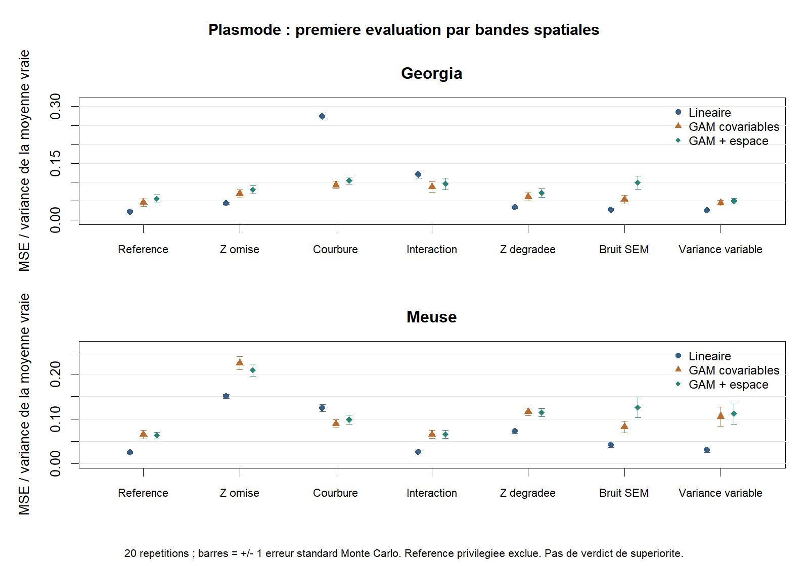

# Premier pilote plasmode — 8 septembre 2026

Le cadrage demandé par l’encadrant est appliqué : plasmode exclusivement, avec distinction entre information omise, forme du modèle et processus d’observation. Les sept scénarios du pilote ne couvrent pas toute la grille D0–D9.

Exécution effective : 1120 évaluations agrégées sur trois folds, soit 3360 ajustements ; 20 réplications par source/scénario ; aucun échec ni warning de modèle. Les avertissements de locale au démarrage de R sont distincts. Trois concurrents et une référence diagnostique privilégiée sont séparés.

## Ce que ce pilote montre

La présence d’un motif spatial dépend du signal réellement laissé inexpliqué. Pour Meuse, la courbure non représentée par le modèle linéaire présente un Moran descriptif de 0.304 ; pour Georgia, il est de -0.083. Une même famille de scénario ne garantit donc pas un effet spatial dans chaque dataset.

L’interaction de Meuse a un motif spatial résiduel descriptif (Moran 0.297) mais une variance inexpliquée de seulement 0.0004 : elle est trop faible, dans ce design, pour créer une grande difficulté. La force du motif et son amplitude doivent être examinées ensemble.

Sur la courbure de Georgia, la MSE normalisée moyenne passe de 0.274 pour le modèle linéaire à 0.092 pour le GAM sur covariables, contre 0.104 pour le GAM avec espace. Ici, la flexibilité des covariables suffit à améliorer la prédiction ; ajouter l’espace n’apporte pas automatiquement mieux. Ce sont des résultats descriptifs conditionnels, pas un verdict statistique.

Sur Meuse avec Z omise, le GAM spatial obtient 0.209 contre 0.225 pour le GAM sur covariables ; le modèle linéaire reste à 0.150. Ce pilote ne montre donc pas une supériorité générale des méthodes spatiales lorsque Z manque. La référence privilégiée ne constitue pas non plus une borne parfaite : son estimation et sa complexité ajoutent de la variance.

Le contrôle SEM produit des innovations spatialement corrélées (Moran moyen proche de 0.17 dans les deux sources). Le contrôle à variance variable conserve une covariance diagonale par construction ; une hétéroscédasticité spatialisée n’équivaut pas à une corrélation entre erreurs.

## Sources et fidélité du générateur

| Source | Lignes source | Calibration | Évaluation | Lignes exclues | R² réel hors calibration |
| --- | --- | --- | --- | --- | --- |
| georgia | 159 | 53 | 106 | 0 | 0.235 |
| meuse | 155 | 51 | 102 | 2 | 0.747 |

Le R² mesure la prédiction du Y réel par le générateur complet sur les sites non utilisés pour son ajustement. Il est de 0.235 pour Georgia et 0.747 pour Meuse. Le réalisme de Georgia est donc limité avec cette base. Ces sites sont intercalés géographiquement avec la calibration : ce contrôle de fidélité n’est pas une validation indépendante par région.

Georgia : les colonnes longitude/latitude et les variables sont vérifiées contre spgwr::gSRDF par AreaKey ; la géométrie sf convertie incohérente est contournée seulement dans ce pilote. Meuse : x/y métriques RDH documentés ; deux lignes sans om retirées. Les originaux et le registre package sont conservés.

La base y ~ x1 + x2 + z + I(x1²) + I(x2²) + x1:x2 est un choix système ajusté sur le réel, pas une formule publiée. Les scénarios désactivent ses blocs estimés. Ils ne prétendent pas représenter tous les phénomènes possibles. Georgia conserve l’échelle de PctBach dans le signal, mais le bruit gaussien ne garantit pas les bornes 0–100 d’un pourcentage.

## Performance des concurrents

MSE normalisée = moyenne des erreurs quadratiques sur la moyenne latente connue, divisée par sa variance sur les sites. Valeur plus faible = erreur plus faible pour cette cible. ± désigne une erreur standard Monte Carlo, pas un intervalle de confiance intégrant l’incertitude des sources ou du générateur.



## Georgia

| Scénario | Linéaire | GAM covariables | GAM + espace |
| --- | --- | --- | --- |
| P0 Référence | 0.022 ± 0.003 | 0.046 ± 0.010 | 0.056 ± 0.011 |
| P1 Z omise | 0.044 ± 0.003 | 0.069 ± 0.010 | 0.080 ± 0.011 |
| P2 Courbure | 0.274 ± 0.009 | 0.092 ± 0.010 | 0.104 ± 0.010 |
| P3 Interaction | 0.120 ± 0.009 | 0.087 ± 0.014 | 0.095 ± 0.015 |
| P4 Z dégradée | 0.034 ± 0.003 | 0.061 ± 0.011 | 0.071 ± 0.011 |
| P5 Bruit SEM | 0.027 ± 0.003 | 0.054 ± 0.011 | 0.099 ± 0.017 |
| P6 Variance variable | 0.026 ± 0.004 | 0.044 ± 0.007 | 0.050 ± 0.008 |

## Meuse

| Scénario | Linéaire | GAM covariables | GAM + espace |
| --- | --- | --- | --- |
| P0 Référence | 0.025 ± 0.003 | 0.065 ± 0.010 | 0.063 ± 0.007 |
| P1 Z omise | 0.150 ± 0.005 | 0.225 ± 0.015 | 0.209 ± 0.014 |
| P2 Courbure | 0.124 ± 0.008 | 0.089 ± 0.009 | 0.098 ± 0.010 |
| P3 Interaction | 0.026 ± 0.003 | 0.065 ± 0.009 | 0.066 ± 0.009 |
| P4 Z dégradée | 0.072 ± 0.004 | 0.116 ± 0.009 | 0.114 ± 0.009 |
| P5 Bruit SEM | 0.041 ± 0.005 | 0.082 ± 0.013 | 0.125 ± 0.022 |
| P6 Variance variable | 0.030 ± 0.005 | 0.105 ± 0.022 | 0.112 ± 0.023 |

## Signal laissé inexpliqué par une référence linéaire

Diagnostic sur la vérité connue, projetée sur les variables accessibles au modèle linéaire. Ce calcul utilise m uniquement pour l’analyse et ne fournit aucune information aux concurrents. Il faut distinguer ces résidus déterministes des résidus bruités hors échantillon du tableau suivant. Un tiret indique un signal nul à la précision numérique.

| Source | Scénario | Variance inexpliquée | Moran du signal inexpliqué |
| --- | --- | --- | --- |
| georgia | P0 Référence | 0.0000 | — |
| georgia | P1 Z omise | 0.5229 | 0.175 |
| georgia | P2 Courbure | 2.4225 | -0.083 |
| georgia | P3 Interaction | 0.5783 | 0.155 |
| georgia | P4 Z dégradée | 0.2003 | 0.160 |
| georgia | P5 Bruit SEM | 0.0000 | — |
| georgia | P6 Variance variable | 0.0000 | — |
| meuse | P0 Référence | 0.0000 | — |
| meuse | P1 Z omise | 0.0674 | 0.274 |
| meuse | P2 Courbure | 0.0266 | 0.304 |
| meuse | P3 Interaction | 0.0004 | 0.297 |
| meuse | P4 Z dégradée | 0.0260 | 0.027 |
| meuse | P5 Bruit SEM | 0.0000 | — |
| meuse | P6 Variance variable | 0.0000 | — |

## Résidus hors échantillon et contrôle privilégié

Moran descriptif moyen sur les prédictions assemblées des trois folds, sans p-value. La référence privilégiée reçoit la vraie Z et la base du générateur ; elle est exclue de la figure des concurrents. Aucun classement global, regret agrégé ni verdict win/tie/loss n’est produit.

| Source | Scénario | Méthode | Rôle | MSE normalisée | Moran résiduel |
| --- | --- | --- | --- | --- | --- |
| georgia | P2 Courbure | GAM covariables | concurrent | 0.092 | -0.014 |
| meuse | P2 Courbure | GAM covariables | concurrent | 0.089 | 0.073 |
| georgia | P6 Variance variable | GAM covariables | concurrent | 0.044 | -0.030 |
| meuse | P6 Variance variable | GAM covariables | concurrent | 0.105 | 0.071 |
| georgia | P3 Interaction | GAM covariables | concurrent | 0.087 | -0.014 |
| meuse | P3 Interaction | GAM covariables | concurrent | 0.065 | 0.053 |
| georgia | P4 Z dégradée | GAM covariables | concurrent | 0.061 | -0.018 |
| meuse | P4 Z dégradée | GAM covariables | concurrent | 0.116 | 0.061 |
| georgia | P1 Z omise | GAM covariables | concurrent | 0.069 | -0.012 |
| meuse | P1 Z omise | GAM covariables | concurrent | 0.225 | 0.146 |
| georgia | P0 Référence | GAM covariables | concurrent | 0.046 | -0.012 |
| meuse | P0 Référence | GAM covariables | concurrent | 0.065 | 0.049 |
| georgia | P5 Bruit SEM | GAM covariables | concurrent | 0.054 | 0.181 |
| meuse | P5 Bruit SEM | GAM covariables | concurrent | 0.082 | 0.241 |
| georgia | P2 Courbure | GAM + espace | concurrent | 0.104 | -0.006 |
| meuse | P2 Courbure | GAM + espace | concurrent | 0.098 | 0.080 |
| georgia | P6 Variance variable | GAM + espace | concurrent | 0.050 | -0.024 |
| meuse | P6 Variance variable | GAM + espace | concurrent | 0.112 | 0.082 |
| georgia | P3 Interaction | GAM + espace | concurrent | 0.095 | -0.012 |
| meuse | P3 Interaction | GAM + espace | concurrent | 0.066 | 0.050 |
| georgia | P4 Z dégradée | GAM + espace | concurrent | 0.071 | -0.018 |
| meuse | P4 Z dégradée | GAM + espace | concurrent | 0.114 | 0.055 |
| georgia | P1 Z omise | GAM + espace | concurrent | 0.080 | -0.009 |
| meuse | P1 Z omise | GAM + espace | concurrent | 0.209 | 0.119 |
| georgia | P0 Référence | GAM + espace | concurrent | 0.056 | -0.007 |
| meuse | P0 Référence | GAM + espace | concurrent | 0.063 | 0.047 |
| georgia | P5 Bruit SEM | GAM + espace | concurrent | 0.099 | 0.193 |
| meuse | P5 Bruit SEM | GAM + espace | concurrent | 0.125 | 0.264 |
| georgia | P2 Courbure | Linéaire | concurrent | 0.274 | -0.016 |
| meuse | P2 Courbure | Linéaire | concurrent | 0.124 | 0.117 |
| georgia | P6 Variance variable | Linéaire | concurrent | 0.026 | -0.023 |
| meuse | P6 Variance variable | Linéaire | concurrent | 0.030 | 0.007 |
| georgia | P3 Interaction | Linéaire | concurrent | 0.120 | 0.050 |
| meuse | P3 Interaction | Linéaire | concurrent | 0.026 | 0.015 |
| georgia | P4 Z dégradée | Linéaire | concurrent | 0.034 | -0.022 |
| meuse | P4 Z dégradée | Linéaire | concurrent | 0.072 | 0.019 |
| georgia | P1 Z omise | Linéaire | concurrent | 0.044 | -0.011 |
| meuse | P1 Z omise | Linéaire | concurrent | 0.150 | 0.093 |
| georgia | P0 Référence | Linéaire | concurrent | 0.022 | -0.016 |
| meuse | P0 Référence | Linéaire | concurrent | 0.025 | 0.014 |
| georgia | P5 Bruit SEM | Linéaire | concurrent | 0.027 | 0.192 |
| meuse | P5 Bruit SEM | Linéaire | concurrent | 0.041 | 0.229 |
| georgia | P2 Courbure | Base complète privilégiée | diagnostic privilégié | 0.059 | -0.013 |
| meuse | P2 Courbure | Base complète privilégiée | diagnostic privilégié | 0.077 | 0.092 |
| georgia | P6 Variance variable | Base complète privilégiée | diagnostic privilégié | 0.045 | -0.027 |
| meuse | P6 Variance variable | Base complète privilégiée | diagnostic privilégié | 0.123 | 0.126 |
| georgia | P3 Interaction | Base complète privilégiée | diagnostic privilégié | 0.059 | -0.013 |
| meuse | P3 Interaction | Base complète privilégiée | diagnostic privilégié | 0.077 | 0.092 |
| georgia | P4 Z dégradée | Base complète privilégiée | diagnostic privilégié | 0.059 | -0.013 |
| meuse | P4 Z dégradée | Base complète privilégiée | diagnostic privilégié | 0.077 | 0.092 |
| georgia | P1 Z omise | Base complète privilégiée | diagnostic privilégié | 0.059 | -0.013 |
| meuse | P1 Z omise | Base complète privilégiée | diagnostic privilégié | 0.077 | 0.092 |
| georgia | P0 Référence | Base complète privilégiée | diagnostic privilégié | 0.059 | -0.013 |
| meuse | P0 Référence | Base complète privilégiée | diagnostic privilégié | 0.077 | 0.092 |
| georgia | P5 Bruit SEM | Base complète privilégiée | diagnostic privilégié | 0.065 | 0.179 |
| meuse | P5 Bruit SEM | Base complète privilégiée | diagnostic privilégié | 0.083 | 0.264 |

## Tests, reproduction et limites

Les tests passent : coordonnées et clés Georgia, partitions disjointes, W standardisé, graines reproductibles, égalité de Y entre référence/omission/proxy, décomposition du générateur, SNR attendu, covariance SEM ou diagonale selon le contrôle, absence de dépendance aux Y de test pour la calibration et la prédiction.

Le SNR attendu est 3 ; W utilise quatre plus proches voisins symétrisés puis standardisés par ligne, en mètres. Les paramètres et matrices sont conservés. Les trois bandes est-ouest sont fixes, sans tampon spatial. Les effectifs sont petits ; aucune convergence du nombre de réplications n’est démontrée.

Dans le scénario de mesure dégradée, on évalue la moyenne latente sur les sites et covariables complets fixes. On ne connaît pas ici une fonction de population E[Y|X bruités] intégrant toutes les réalisations possibles de l’erreur de mesure. Le proxy n’est tiré qu’une fois ; cette limite doit être levée dans une étude plus large.

Ces scripts autonomes testent lm et mgcv ; ils ne certifient pas les wrappers de spatialtidymodels. Aucune simulation SVC, SAR, g(s), changement de support ou lissage n’est exécutée. La note originale de l’encadrant et les admissions du catalogue restent inchangées.

```powershell
Rscript extensions_projet_2026-09/revue_donnees_semi_synthetiques/test_plasmode_pilot.R
Rscript extensions_projet_2026-09/revue_donnees_semi_synthetiques/plasmode_pilot.R 20
Rscript extensions_projet_2026-09/revue_donnees_semi_synthetiques/plot_plasmode_pilot.R
python extensions_projet_2026-09/revue_donnees_semi_synthetiques/report_plasmode_pilot.py
```

L’enrichissement des diagnostics de projection a été exécuté par enrich_pilot_diagnostics.R sur les objets sauvegardés, sans réajuster les concurrents ; le pilote courant calcule également ces champs directement. Les objets sources sont contrôlés par empreinte MD5 dans le run. Le contrôle externe SHA256 confirme les deux RDS inchangés ; il observe aussi des modifications concomitantes de fiches et registres hors pilote, conservées sans intervention. Le détail à l’instant du contrôle est dans preservation_check.json. La synthèse originale de l’encadrant est inchangée.

## Décisions proposées avant la suite

Retenir Meuse pour approfondir la courbure et l’omission ; conserver Georgia comme contre-exemple de fidélité limitée, sans remplacer a posteriori les résultats. Choisir une seconde famille génératrice avant toute conclusion sur les méthodes ; répliquer les folds et les proxies, examiner un tampon spatial, puis augmenter les réplications selon la précision requise.

L’agrégation et le lissage restent des pistes distinctes à formaliser avec de vraies unités et groupes. La priorité est de valider avec l’encadrant les mécanismes et les cibles de ce pilote, puis seulement d’étendre lambda, f, g et u et d’intégrer les routes au package.

[Protocole détaillé](../../../wiki/analyses/protocole_plasmode_spatial_2026-09-08.md) · [Résultats JSON](results.json) · [Résultats RDS](results.rds)
