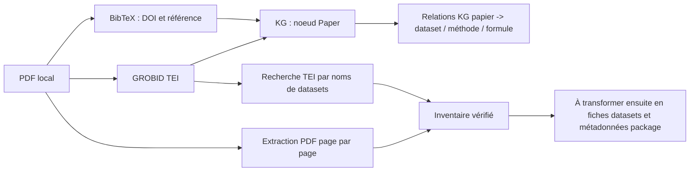
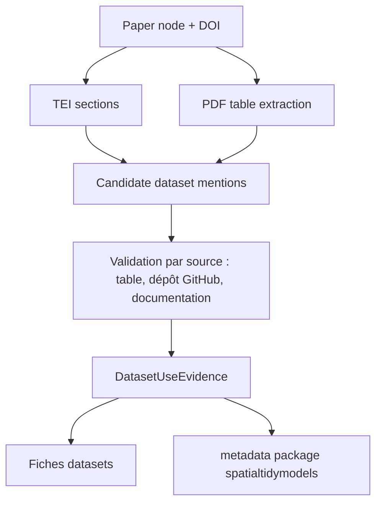

# Inventaire papier -> datasets : essai top-down MGWR

Date : 2026-07-27

## Objectif

Tester le conduit local `papier -> BibTeX/DOI -> KG -> TEI -> PDF -> datasets candidats` sur un papier qui utilise plusieurs jeux de données réels, sans inventer les éléments absents.

Papier pilote :

- PDF local : `corpus/papers/raw_pdf/Journal of Geographical Systems_geniaux_2026_top down scale for MGWR.pdf`
- TEI local : `corpus/papers/tei/Journal of Geographical Systems_geniaux_2026_top down scale for MGWR.tei.xml`
- Entrée BibTeX : `Geniaux2026TopDownScale`
- DOI : `10.1007/s10109-025-00481-4`
- Titre : `Top-down scale approaches for multiscale GWR with locally adaptive bandwidths`

## Pipeline appliqué

## Papiers locaux candidats avec DOI

Premier filtrage conservateur : entrées BibTeX avec PDF local dans `corpus/papers/raw_pdf` et titre ou fichier évoquant dataset, application, case study, spatial, GWR, MGWR, house, Airbnb, field, crop, package, etc.

| BibTeX key | Année | DOI | Titre |
|---|---:|---|---|
| Murakami2019 | 2019 | `10.1016/j.spasta.2019.02.003` | Spatially varying coefficient modeling for large datasets: Eliminating N from spatial regressions |
| Lu2014 | 2014 | `10.1080/13658816.2013.865739` | Geographically weighted regression with a non-Euclidean distance metric: a case study using hedonic house price data |
| Geniaux2018 | 2018 | `10.1016/j.regsciurbeco.2017.04.001` | A new method for dealing simultaneously with spatial autocorrelation and spatial heterogeneity in regression models |
| Meyer2017 | 2017 | `10.18637/jss.v077.i11` | Spatio-Temporal Analysis of Epidemic Phenomena Using the R Package surveillance |
| Nakaya2016GWR409Manual | 2016 | non trouvé dans BibTeX | GWR4.09 User Manual |
| Chaves2025 | 2025 | `10.1038/s41437-024-00743-9` | Incorporating spatial and genetic competition into breeding pipelines with the R package gencomp |
| Kayad2016 | 2016 | `10.1371/journal.pone.0157166` | Assessing the Spatial Variability of Alfalfa Yield Using Satellite Imagery and Ground-Based Data |
| Besag1999 | 1999 | `10.1111/1467-9868.00201` | Bayesian Analysis of Agricultural Field Experiments |
| Bicak2026 | 2026 | `10.1007/s10109-026-00493-8` | Efficiency of spatially multiscale machine learning models in addressing spatial non-stationarity and enhancing predictive accuracy |
| Gotway1997 | 1997 | `10.2307/1400401` | A Generalized Linear Model Approach to Spatial Data Analysis and Prediction |
| Durban2003 | 2003 | `10.1198/1085711031265` | The practical use of semiparametric models in field trials |
| Fotheringham2017 | 2017 | `10.1080/24694452.2017.1352480` | Multiscale Geographically Weighted Regression (MGWR) |
| Comber2023 | 2023 | `10.1080/13658816.2023.2270285` | Multiscale spatially varying coefficient modelling using a Geographical Gaussian Process GAM |
| Lessani2024 | 2024 | `10.1080/13658816.2024.2342319` | SGWR: similarity and geographically weighted regression |
| Li2022 | 2022 | `10.1016/j.compenvurbsys.2022.101845` | Extracting spatial effects from machine learning model using local interpretation method: SHAP and XGBoost |
| Yun2021 | 2021 | `10.1017/aae.2021.29` | Spatial Panel Models of Crop Yield Response to Weather |
| Bivand2021 | 2021 | `10.3390/math9111276` | A Review of Software for Spatial Econometrics in R |
| GeniauxSpboost | non renseignée | non trouvé dans BibTeX | Flexible nonlinear spatial autoregressive models: a gradient boosting approach with closed-form estimation |
| Gollini2015GWmodel | 2015 | `10.18637/jss.v063.i17` | GWmodel: An R Package for Exploring Spatial Heterogeneity Using Geographically Weighted Models |
| Lu2014GWmodelFurtherTopics | 2014 | `10.1080/10095020.2014.917453` | The GWmodel R Package: Further Topics for Exploring Spatial Heterogeneity Using Geographically Weighted Models |
| Anselin2004NitrogenManagement | 2004 | non trouvé dans BibTeX | A Spatial Econometric Approach to the Economics of Site-Specific Nitrogen Management in Corn Production |
| Anselin1988SpatialEconometrics | 1988 | `10.1007/978-94-015-7799-1` | Spatial Econometrics: Methods and Models |
| Geniaux2026TopDownScale | 2026 | `10.1007/s10109-025-00481-4` | Top-down scale approaches for multiscale GWR with locally adaptive bandwidths |
| Christensen2025EdgeWeightDimensionReduction | 2025 | `10.48550/arXiv.2407.02684` | A dimension reduction approach to edge weight estimation for use in spatial models |
| Dray2011GuerrySpatialConstraints | 2011 | `10.1214/10-AOAS356` | Revisiting Guerry's data: Introducing spatial constraints in multivariate analysis |
| Rakshit2020OnFarmExperiments | 2020 | `10.1016/j.fcr.2020.107783` | Novel approach to the analysis of spatially-varying treatment effects in on-farm experiments |
| Arbia2025SampledGridPairwiseLikelihood | 2025 | `10.48550/arXiv.2507.07113` | Sampled Grid Pairwise Likelihood (SG-PL) |
| Grubesic2014SpatialClustering | 2014 | `10.1080/00045608.2014.958389` | Spatial Clustering Overview and Comparison |
| Xia1998OhioLungCancer | 1998 | `10.1002/(SICI)1097-0258(19980930)17:18<2025::AID-SIM865>3.0.CO;2-M` | Spatio-temporal models with errors in covariates |
| WangGWRBoost | non renseignée | non trouvé dans BibTeX | GWRBoost |
| Kelejian1992SpatialAutocorrelationTest | 1992 | `10.1016/0166-0462(92)90032-V` | Spatial autocorrelation test with police expenditures |
| MurakamiSpmoranPackage | non renseignée | `10.32614/CRAN.package.spmoran` | spmoran R package |
| Pebesma2012Spacetime | 2012 | `10.18637/jss.v051.i07` | spacetime: Spatio-Temporal Data in R |

Le filtrage a trouvé 45 entrées candidates sur 64 entrées BibTeX avec PDF local. Le tableau ci-dessus ne garde que les candidats prioritaires pour l'insertion dataset/package.

## Ce que le KG dit aujourd'hui sur le papier top-down

Le KG contient le noeud papier :

- `paper:doi:10.1007/s10109-025-00481-4`
- titre : `Top-down scale approaches for multiscale GWR with locally adaptive bandwidths`

Relations fiables trouvées :

- `MENTIONS_METHOD`: GWR, MGWR, multiscale GWR, spatial regression, spatial heterogeneity, spatial autocorrelation.

Relations suspectes trouvées :

- `USES_DATASET`: `AER::ResumeNames`, `AER::TradeCredit`, `agridat::harris.multi.uniformity`, `agridat::mcleod.barley`, `MASS::Cars93`.
- `SHOWS_FORMULA`: plusieurs formules inférées depuis des noms de variables sans rapport direct avec les datasets réels du papier.

Conclusion : pour ce papier, les liens automatiques `USES_DATASET` et `SHOWS_FORMULA` du KG ne doivent pas être utilisés sans validation. Ils proviennent de l'inférence automatique TEI par correspondance de noms de variables, pas d'une table de datasets correctement extraite.

## Datasets réels confirmés dans le PDF top-down

Source : extraction PDF directe, page 30, Table 5.

| Dataset | Thème | Taille | Covariables | Source mentionnée dans le papier | Statut KG actuel |
|---|---|---:|---:|---|---|
| Georgia | Socio-demographic | 159 | 4 | PySAL examples | présent dans KG et package, relation au papier top-down absente |
| Clearwater | Landslide | 239 | 6 | PySAL examples | catalogue KG présent, mais n affiché comme 14 dans le catalogue local ; incohérence à vérifier |
| Tokyo | Mortality | 262 | 5 | PySAL examples | catalogue KG présent, mais seulement 3 variables dans le catalogue local ; covariables à vérifier |
| Berlin | Airbnb rental price | 2203 | 3 | PySAL examples | catalogue KG présent, mais fichier vectoriel non trouvé dans l'extraction actuelle |
| VaucluseHousePrice | House price | 3215 | 12 | DVF / data.gouv.fr + dépôt GitHub du papier | absent du KG local |
| KingHousePrices | House price | 18788 | 8 | Kaggle House Sales Prediction + dépôt GitHub du papier | absent sous ce nom dans le KG local |
| NYCAirBnb | Airbnb rental price | 38782 | 7 | Kaggle NYC Airbnb Open Data + dépôt GitHub du papier | absent sous ce nom dans le KG local |

Le papier indique aussi que les 7 datasets sont mis à disposition sur un dépôt GitHub de reproduction : `https://github.com/ggeniaux/tds_mgwr_datasets`.

## Informations méthodologiques confirmées dans le PDF

Source : extraction PDF directe, pages 29 à 31.

- Évaluation par validation croisée aléatoire à 5 folds.
- À chaque fold, un cinquième des observations est prédit avec un modèle estimé sur les quatre cinquièmes restants.
- Méthodes comparées : `GWR`, `multiscale_gwr`, `Python MGWR`, `tds_mgwr`, `atds_mgwr`.
- Pour les prédictions hors-échantillon, les coefficients sont extrapolés avec un noyau gaussien adaptatif.
- Certains calculs sont sautés si une validation croisée dépasse 8 heures par fold.
- `atds_mgwr` n'est pas fourni pour les datasets de plus de 5000 observations, car il nécessite le calcul du global AIC à chaque itération.
- Python MGWR échoue sur `King_house` et `NYCAirBnb` à cause de problèmes de singularité pendant l'estimation locale.

## Spatialité des datasets

Ce qui est explicitement établi par les sources locales :

- Le papier les traite comme datasets spatiaux pour GWR/MGWR.
- Les modèles reposent sur des localisations spatiales et des noyaux de distance.
- Les sources PySAL/Kaggle/DVF/GitHub sont mentionnées, mais le TEI ne donne pas les colonnes de coordonnées ni les CRS.

Ce qui doit encore être vérifié dataset par dataset avant insertion dans le package :

- colonnes de coordonnées ;
- CRS ;
- type de géométrie ;
- matrice de voisinage ou règle de distance ;
- formule exacte utilisée par le papier ;
- noms des covariables utilisées ;
- transformations éventuelles de la variable réponse.

## Prochaine action recommandée

Pour éviter de répéter cette extraction manuellement, ajouter une étape dédiée au pipeline KG :

Nouvelle relation à modéliser : `PaperDatasetUse`.

Champs minimaux :

- `paper_id`
- `dataset_name_in_paper`
- `canonical_dataset_id`
- `source_url`
- `source_type`
- `n_observations`
- `n_covariates`
- `theme`
- `estimators_used`
- `cv_scheme`
- `formula`
- `spatial_characterization`
- `evidence_page`
- `confidence`
- `status`

Pour ce papier, le statut initial doit être :

- `Georgia`: résolu partiellement, déjà disponible localement.
- `Clearwater`, `Tokyo`, `Berlin`: présents dans le catalogue, mais à réconcilier avec la Table 5.
- `VaucluseHousePrice`, `KingHousePrices`, `NYCAirBnb`: à importer depuis les sources mentionnées par le papier, idéalement depuis le dépôt GitHub de reproduction avant Kaggle/DVF.
