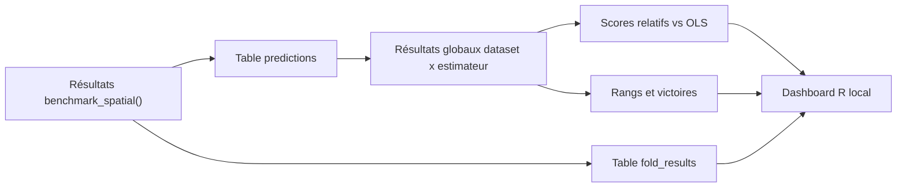

# Benchmark spatialtidymodels : critères de choix et trajectoire dashboard

## Objectif

La mission `spatialtidymodels` vise à comparer plusieurs estimateurs de régression spatiale et non spatiale sur plusieurs jeux de données spatiaux. L'objectif n'est pas seulement de désigner un gagnant global, mais de produire un protocole reproductible permettant d'identifier :

- le meilleur estimateur sur un jeu de données donné ;
- le meilleur estimateur selon un schéma de validation donné ;
- les estimateurs robustes sur plusieurs jeux de données ;
- les compromis performance prédictive, autocorrélation résiduelle, durée de calcul et stabilité ;
- les situations où plusieurs estimateurs sont pratiquement équivalents.

Le dashboard final sera construit sous R pour le projet local et versionné dans le dépôt Git. Une version PowerBI pourra être produite en parallèle à partir des tables exportées.

## Principe général du benchmark

Un benchmark sérieux doit comparer des pipelines dans des conditions identiques. Pour chaque dataset, tous les estimateurs doivent utiliser :

- la même variable réponse ;
- la même formule de benchmark par défaut ;
- les mêmes partitions train/test ;
- les mêmes métriques ;
- une stratégie de tuning documentée ;
- un suivi des erreurs, des folds échoués et du temps de calcul.

La comparaison principale doit donc porter sur :

```text
dataset x estimator x cv_scheme x fold x metric
```

Les résultats fold par fold restent conservés pour le diagnostic, mais les métriques principales sont calculées sur les prédictions out-of-sample concaténées.

## Schémas de validation

Le benchmark spatial doit distinguer plusieurs situations de prédiction.

| Schéma | Rôle | Interprétation |
|---|---|---|
| `near_prediction` | prédiction locale autour de zones observées | proche d'une situation d'interpolation spatiale |
| `block_spatial` | prédiction dans des blocs spatiaux séparés | test plus exigeant de généralisation spatiale |
| `holdout_10pct` | test rapide de validation | utile pour debug et premiers essais |
| `vfold_cv` | validation ML standard | à utiliser avec prudence si autocorrélation spatiale forte |

La littérature sur la validation spatiale rappelle qu'une validation aléatoire peut surestimer la performance si les observations test sont proches des observations train. C'est pourquoi `near_prediction` et `block_spatial` doivent rester explicitement séparés dans les résultats.

## Structure des résultats à produire

### 1. Table des prédictions

Cette table est la base la plus importante.

```text
dataset
estimator
cv_scheme
fold_id
row_id
y_true
y_pred
residual
formula_role
formula_used
```

Elle permet de recalculer les métriques, de visualiser les erreurs, et de vérifier les observations problématiques.

### 2. Table fold par fold

```text
dataset
estimator
cv_scheme
fold_id
n_train
n_test
rmse
mae
moran_i
moran_p_value
duration_sec
fit_error
```

Cette table sert au diagnostic : folds atypiques, estimateurs instables, erreurs de convergence, temps excessif.

### 3. Table principale dataset x estimateur

Les métriques principales doivent être calculées après concaténation des prédictions out-of-sample.

```text
dataset
estimator
cv_scheme
n_test_total
rmse_global
mae_global
moran_i_global
moran_p_value_global
duration_total_sec
n_failed_folds
failure_rate
```

Cette table répond à la question : "sur ce dataset, selon ce schéma de validation, quel estimateur prédit le mieux ?"

### 4. Table normalisée par rapport à une baseline

Les RMSE bruts ne sont pas comparables entre datasets de différentes unités. Il faut donc produire des scores relatifs.

```text
relative_rmse_vs_ols = rmse_model / rmse_ols
skill_vs_ols = 1 - rmse_model / rmse_ols
```

Interprétation :

- `relative_rmse_vs_ols < 1` : meilleur que OLS ;
- `relative_rmse_vs_ols = 1` : équivalent à OLS ;
- `relative_rmse_vs_ols > 1` : moins bon que OLS ;
- `skill_vs_ols > 0` : gain par rapport à OLS.

### 5. Table globale multi-datasets

```text
estimator
cv_scheme
mean_relative_rmse_vs_ols
median_relative_rmse_vs_ols
mean_rank_rmse
median_rank_rmse
wins
losses
ties
failure_rate
median_duration_sec
pareto_status
```

Cette table alimentera le classement global du dashboard.

## Critères de choix recommandés

Il ne faut pas choisir un estimateur uniquement par le RMSE moyen. La décision doit combiner plusieurs critères.

| Critère | Utilisation |
|---|---|
| RMSE global | métrique prédictive principale en régression |
| MAE global | robustesse aux grosses erreurs |
| Moran I des résidus | vérifie si la structure spatiale résiduelle reste forte |
| durée totale | coût pratique de l'estimateur |
| taux d'échec | stabilité numérique et opérationnelle |
| rang moyen | comparaison multi-datasets indépendante des unités |
| skill vs OLS | gain relatif par rapport à une baseline simple |
| front de Pareto | compromis performance / durée / stabilité |

La règle recommandée est hiérarchique :

1. exclure les estimateurs avec trop d'échecs ;
2. comparer le RMSE global ;
3. utiliser le MAE global comme métrique secondaire ;
4. examiner Moran I résiduel ;
5. comparer la durée totale ;
6. pour plusieurs datasets, utiliser les rangs moyens et les scores relatifs à OLS ;
7. si plusieurs méthodes sont proches, retenir la plus simple, stable ou rapide.

## Rôle des formules

Pour une comparaison stricte des estimateurs, il faut utiliser une formule commune par dataset :

```text
formula_role = "benchmark"
```

Les fiches datasets peuvent stocker plusieurs profils :

- `univariate` : formule simple, souvent utile pour baseline ou exemple pédagogique ;
- `multivariate_constrained` : formule issue d'un papier ou d'une documentation, adaptée aux modèles paramétriques/spatiaux ;
- `ml_or_selected` : ensemble de variables plus large, utile pour Random Forest, XGBoost, GAMBoost, SpBoost.

Mais le benchmark principal doit garder une formule commune pour tous les estimateurs. Les formules spécifiques par estimateur doivent être utilisées dans un mode séparé, interprété comme comparaison de pipelines adaptés, pas comme comparaison pure d'estimateurs.

## Dashboard R prévu

Le dashboard R devra contenir :




Vues recommandées :

- onglets par `cv_scheme` ;
- heatmap dataset x estimateur avec RMSE relatif à OLS ;
- graphique performance vs durée ;
- graphique Moran I résiduel ;
- tableau des folds échoués ;
- classement global par rang moyen ;
- filtre par famille d'estimateurs ;
- filtre par rôle de formule.

## Références scientifiques à mobiliser

- Demšar, J. (2006). *Statistical Comparisons of Classifiers over Multiple Data Sets*. Journal of Machine Learning Research, 7, 1-30. Référence classique pour rangs, Wilcoxon, Friedman, Nemenyi et critical-difference diagrams.
- Hothorn, T., Leisch, F., Zeileis, A. & Hornik, K. (2005). *The Design and Analysis of Benchmark Experiments*. Journal of Computational and Graphical Statistics, 14, 675-699. Cadre statistique général des benchmarks.
- Dietterich, T. G. (1998). *Approximate Statistical Tests for Comparing Supervised Classification Learning Algorithms*. Neural Computation, 10, 1895-1923. Tests statistiques pour comparer deux algorithmes.
- Nadeau, C. & Bengio, Y. (2003). *Inference for the Generalization Error*. Machine Learning, 52, 239-281. Dépendance des folds et incertitude de validation croisée.
- Cawley, G. C. & Talbot, N. L. C. (2010). *On Over-fitting in Model Selection and Subsequent Selection Bias in Performance Evaluation*. Journal of Machine Learning Research, 11, 2079-2107. Biais lié au tuning et à la sélection de modèles.
- Benavoli, A., Corani, G., Demšar, J. & Zaffalon, M. (2017). *Time for a Change: A Tutorial for Comparing Multiple Classifiers Through Bayesian Analysis*. Journal of Machine Learning Research, 18, 1-36. Comparaisons bayésiennes et équivalence pratique.
- Wainer, J. (2023). *A Bayesian Bradley-Terry Model to Compare Multiple ML Algorithms on Multiple Data Sets*. Journal of Machine Learning Research, 24, 1-34. Classement probabiliste par victoires entre estimateurs.
- Bischl, B. et al. (2021). *OpenML Benchmarking Suites*. NeurIPS Datasets and Benchmarks. Suites standardisées et reproductibles de tâches ML.
- Bouthillier, X. et al. (2021). *Accounting for Variance in Machine Learning Benchmarks*. MLSys. Sources de variance dans les benchmarks.
- Weber, L. M. et al. (2019). *Essential Guidelines for Computational Method Benchmarking*. Genome Biology, 20, 125. Recommandations pratiques pour des benchmarks transparents.
- Roberts, D. R. et al. (2017). *Cross-validation Strategies for Data with Temporal, Spatial, Hierarchical, or Phylogenetic Structure*. Ecography, 40, 913-929. Référence majeure pour validation spatiale et temporelle.

## Conclusion

La meilleure approche pour le projet est de produire d'abord des tables propres et reproductibles, puis seulement ensuite un dashboard. La décision ne doit pas reposer sur une métrique unique. Le socle recommandé est :

```text
RMSE global concaténé
+ MAE global
+ Moran I résiduel
+ durée totale
+ taux d'échec
+ score relatif à OLS
+ rang moyen multi-datasets
```

Cette combinaison permettra d'identifier non seulement un gagnant éventuel, mais surtout les estimateurs les plus robustes selon le contexte spatial.
