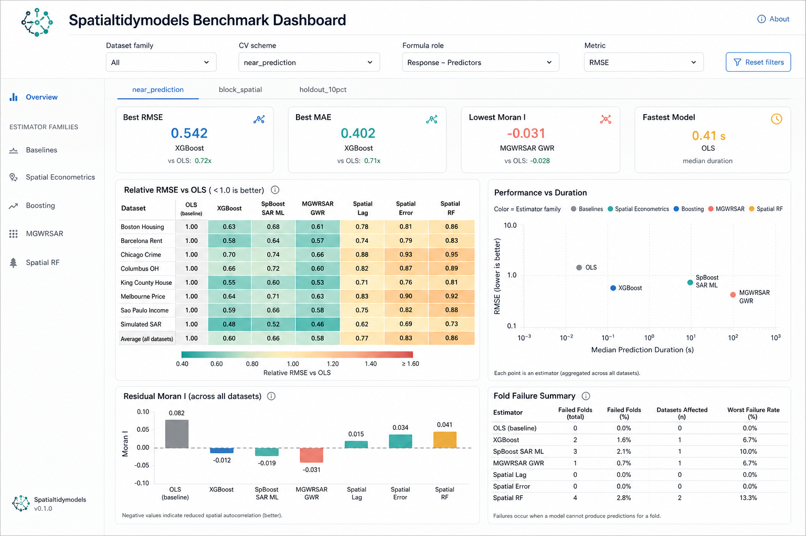
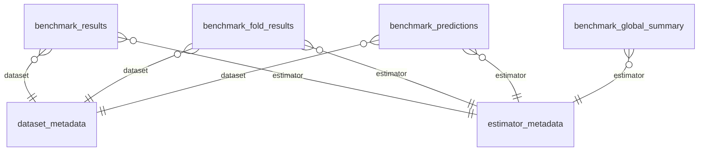
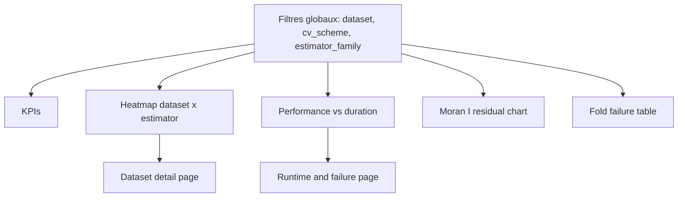

# Brief PowerBI : dashboard benchmark spatialtidymodels

## Objectif du dashboard

Ce dashboard PowerBI doit permettre d'explorer les résultats d'un benchmark de modèles de régression spatiale. Les modèles sont testés sur plusieurs jeux de données, avec plusieurs schémas de validation croisée.



Le dashboard PowerBI ne doit pas recalculer les modèles. Il reçoit uniquement des tables propres exportées depuis R.

L'objectif est de répondre rapidement aux questions suivantes :

- Quel estimateur est le plus performant sur chaque dataset ?
- Quel estimateur est le plus robuste sur plusieurs datasets ?
- Quel estimateur réduit le mieux l'autocorrélation spatiale des résidus ?
- Quel estimateur est le plus rapide ?
- Quels estimateurs échouent sur certains folds ?
- Les résultats changent-ils selon le schéma de validation ?

## Format des fichiers fournis

Les tables seront envoyées au format `.csv` ou `.parquet`.

Format recommandé :

- `.csv` pour une première version simple ;
- `.parquet` si les tables de prédictions deviennent volumineuses.

Encodage attendu pour les `.csv` :

```text
UTF-8
séparateur: comma
décimales: point
```

Les noms de colonnes seront en anglais, sans accents, pour faciliter l'import PowerBI.

## Tables attendues

### 1. `benchmark_results.csv`

Table principale : une ligne par dataset, estimateur et schéma de validation.

Colonnes :

```text
dataset
estimator
estimator_family
cv_scheme
formula_role
formula_used
n_test_total
rmse_global
mae_global
moran_i_global
moran_p_value_global
duration_total_sec
n_failed_folds
failure_rate
relative_rmse_vs_ols
skill_vs_ols
rank_rmse
rank_mae
rank_duration
```

Cette table alimente la plupart des visuels.

### 2. `benchmark_fold_results.csv`

Table de diagnostic fold par fold.

Colonnes :

```text
dataset
estimator
estimator_family
cv_scheme
fold_id
n_train
n_test
rmse
mae
moran_i
moran_p_value
duration_sec
fit_error
```

Cette table sert à diagnostiquer les folds difficiles et les erreurs.

### 3. `benchmark_predictions.csv`

Table optionnelle, potentiellement volumineuse.

Colonnes :

```text
dataset
estimator
cv_scheme
fold_id
row_id
y_true
y_pred
residual
geometry_id
x_coord
y_coord
```

Cette table permet des cartes d'erreurs ou des diagnostics plus fins. Elle peut être livrée plus tard si la première version du dashboard reste légère.

### 4. `benchmark_global_summary.csv`

Table de synthèse globale multi-datasets.

Colonnes :

```text
estimator
estimator_family
cv_scheme
mean_relative_rmse_vs_ols
median_relative_rmse_vs_ols
mean_rank_rmse
median_rank_rmse
wins
losses
ties
failure_rate
median_duration_sec
pareto_status
```

Cette table alimente le classement global.

### 5. `dataset_metadata.csv`

Métadonnées des datasets.

Colonnes :

```text
dataset
dataset_label
topic
source_family
n_observations
t_periods
nt_profile
geometry_type
crs_epsg
response
benchmark_formula
```

Cette table sert aux filtres et aux infobulles.

### 6. `estimator_metadata.csv`

Métadonnées des estimateurs.

Colonnes :

```text
estimator
estimator_label
estimator_family
backend_package
spatial_parameter_type
requires_coords
requires_w
tunable_parameters
notes
```

Cette table sert aux filtres et à la documentation dans le dashboard.

## Relations PowerBI recommandées



La table centrale de la première version est `benchmark_results`.

## Pages recommandées du dashboard

### Page 1 - Overview

Objectif : comprendre rapidement les meilleurs modèles.

Visuels :

- KPI meilleur RMSE ;
- KPI meilleur MAE ;
- KPI plus faible Moran I résiduel ;
- KPI modèle le plus rapide ;
- heatmap dataset x estimateur avec `relative_rmse_vs_ols` ;
- filtre `cv_scheme` ;
- filtre `dataset`;
- filtre `estimator_family`.

Lecture attendue :

- vert si `relative_rmse_vs_ols < 1` ;
- jaune si proche de 1 ;
- rouge si `relative_rmse_vs_ols > 1`.

### Page 2 - Dataset view

Objectif : analyser un dataset précis.

Filtres :

- dataset ;
- cv_scheme ;
- formula_role.

Visuels :

- bar chart RMSE par estimateur ;
- bar chart MAE par estimateur ;
- scatter plot `duration_total_sec` vs `rmse_global` ;
- bar chart Moran I résiduel ;
- tableau détaillé des estimateurs.

### Page 3 - Estimator comparison

Objectif : comparer les estimateurs sur plusieurs datasets.

Visuels :

- classement par rang moyen ;
- nombre de victoires / défaites ;
- boxplot ou violin plot des `relative_rmse_vs_ols` ;
- tableau `benchmark_global_summary`.

### Page 4 - Spatial residual diagnostics

Objectif : voir si les modèles laissent de l'autocorrélation spatiale.

Visuels :

- bar chart Moran I par dataset et estimateur ;
- indicateur `moran_p_value_global < 0.05` ;
- heatmap dataset x estimateur avec Moran I ;
- filtre par schéma de validation.

### Page 5 - Runtime and failures

Objectif : vérifier la faisabilité opérationnelle.

Visuels :

- bar chart durée totale par estimateur ;
- scatter plot RMSE vs durée ;
- tableau des folds échoués ;
- taux d'échec par famille d'estimateur.

## Mesures DAX utiles

Ces mesures peuvent être adaptées selon les noms exacts des tables.

```DAX
Best RMSE =
MIN(benchmark_results[rmse_global])
```

```DAX
Best MAE =
MIN(benchmark_results[mae_global])
```

```DAX
Mean Relative RMSE vs OLS =
AVERAGE(benchmark_results[relative_rmse_vs_ols])
```

```DAX
Mean Skill vs OLS =
AVERAGE(benchmark_results[skill_vs_ols])
```

```DAX
Total Duration Seconds =
SUM(benchmark_results[duration_total_sec])
```

```DAX
Failure Rate =
AVERAGE(benchmark_results[failure_rate])
```

```DAX
Models Better Than OLS =
COUNTROWS(
    FILTER(
        benchmark_results,
        benchmark_results[relative_rmse_vs_ols] < 1
    )
)
```

## Codes couleur recommandés

Pour `relative_rmse_vs_ols` :

| Valeur | Interprétation | Couleur |
|---|---|---|
| < 0.80 | nettement meilleur que OLS | vert foncé |
| 0.80 - 0.95 | meilleur que OLS | vert clair |
| 0.95 - 1.05 | proche de OLS | jaune |
| 1.05 - 1.20 | moins bon que OLS | orange |
| > 1.20 | nettement moins bon | rouge |

Pour `failure_rate` :

| Valeur | Interprétation |
|---|---|
| 0 | stable |
| 0 - 0.10 | quelques échecs |
| > 0.10 | à surveiller |

## Maquette logique



## Ce qui doit ressortir du dashboard

Le dashboard doit permettre de dire :

1. pour chaque dataset, quel estimateur minimise RMSE et MAE ;
2. si ce gain est régulier entre datasets ;
3. si le modèle laisse encore de l'autocorrélation spatiale dans les résidus ;
4. si le modèle est trop coûteux en temps ;
5. si un estimateur est instable ou échoue souvent ;
6. si le classement dépend du schéma de validation.

## Règle d'interprétation

Le dashboard ne doit pas afficher un seul "best model" global sans contexte. Il doit toujours préciser :

```text
best model = best according to metric + cv_scheme + dataset scope
```

Exemples :

- meilleur RMSE sur Boston en `near_prediction` ;
- meilleur rang moyen sur tous les datasets en `block_spatial` ;
- meilleur compromis RMSE / durée parmi les modèles sans fold échoué ;
- modèle avec Moran I résiduel le plus proche de zéro.

## Livraison attendue côté R

L'équipe R produira :

- les tables `.csv` ou `.parquet` ;
- un dictionnaire des variables ;
- une courte note méthodologique ;
- éventuellement une maquette R/Shiny locale versionnée dans Git.

Le dashboard PowerBI pourra ensuite être construit indépendamment à partir des mêmes tables, ce qui garantit que la version R et la version PowerBI racontent la même histoire.
