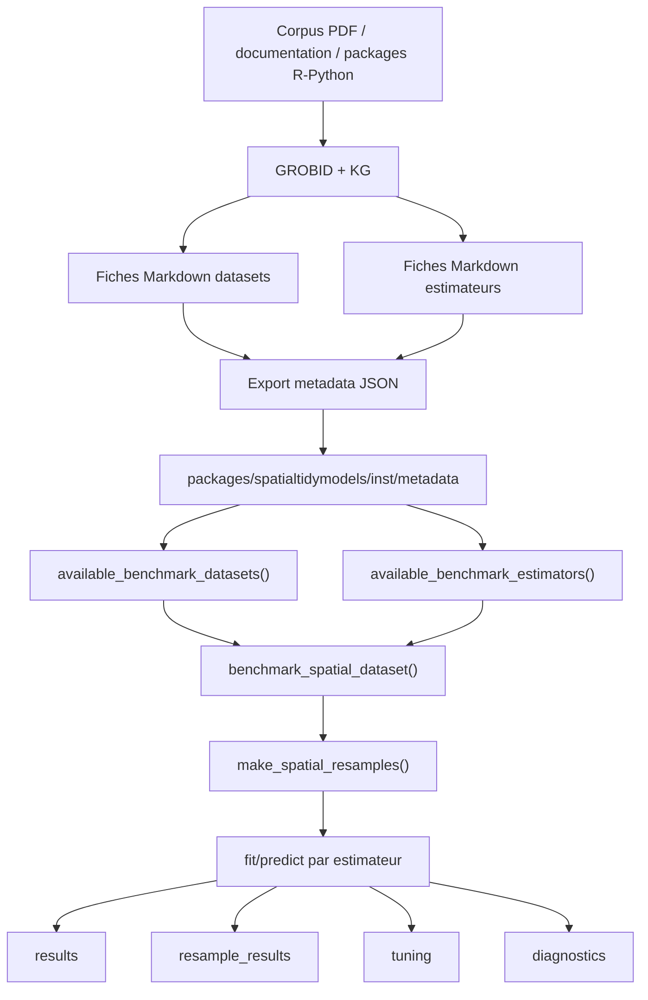

# État actuel du package `spatialtidymodels`

Date : 2026-07

Type : synthèse pédagogique

Objet : expliquer où en est le package `spatialtidymodels`, ce qu'il permet déjà de faire, ce qui reste fragile, et comment il s'insère dans le projet `llm-wiki-karpathy`.

---

## 1. Idée générale

`spatialtidymodels` est le package R que nous construisons pour transformer le travail manuel de benchmark spatial en une API réutilisable.

L'objectif n'est pas seulement d'appeler quelques fonctions R existantes. Le package doit faire le lien entre :

- les jeux de données préparés dans le projet ;
- les fiches metadata des datasets ;
- les fiches estimateurs ;
- les sources scientifiques associées ;
- les estimateurs spatiaux ;
- les workflows de validation croisée ;
- les sorties de benchmark.

L'idée finale est que l'utilisateur puisse faire deux choses.

Premièrement, utiliser un estimateur étape par étape, comme avec un modèle classique :

```r
fit <- fit_sar(
  CRIME ~ HOVAL + INC,
  data = dat,
  coords = c("X", "Y"),
  k_neighbors = 8
)

pred <- predict(fit, new_data = dat)
```

Deuxièmement, lancer automatiquement un benchmark sur un dataset déjà enregistré :

```r
bench <- benchmark_spatial_dataset(
  "boston_housing",
  estimators = c("ols", "xgboost", "sar_lag", "spboost_bspa_sar_ml"),
  cv_scheme = "near_prediction",
  near_n_reps = 3,
  near_test_size = 100,
  verbose = TRUE
)

bench$results
bench$resample_results
```

---

## 2. Schéma du pipeline package



Ce schéma résume l'ambition du projet : les métadonnées humaines du wiki doivent progressivement guider le comportement du package.

---

## 3. Où se trouve le package

Le package est dans :

```text
packages/spatialtidymodels
```

Les fichiers R importants sont :

```text
R/01-spatial-weights.R
R/10-parsnip-spatialreg.R
R/11-fit-spatialreg-shortcuts.R
R/12-diagnose-spatial.R
R/13-benchmark-spatial.R
R/14-spatial-viz.R
R/20-parsnip-spboost.R
R/30-parsnip-mgwrsar.R
R/40-parsnip-spmoran.R
R/60-spatial-ml-forests.R
R/benchmark-datasets.R
R/dials-params.R
R/metadata-registry.R
R/register-parsnip.R
R/spatialtidymodels-package.R
```

Les datasets embarqués sont dans :

```text
packages/spatialtidymodels/data
```

Les métadonnées exportées depuis le wiki sont dans :

```text
packages/spatialtidymodels/inst/metadata/datasets.json
packages/spatialtidymodels/inst/metadata/estimators.json
```

---

## 4. Deux niveaux d'utilisation

### Niveau 1 : usage direct d'un estimateur

Ce niveau est utile pour comprendre ce que fait un modèle.

Exemple :

```r
fit <- fit_sar(
  CRIME ~ HOVAL + INC,
  data = dat,
  coords = c("X", "Y"),
  k_neighbors = 8
)

predict(fit, new_data = dat)
```

Ici, l'utilisateur contrôle la formule, les données, les coordonnées et les paramètres spatiaux.

Ce niveau sert à apprendre et diagnostiquer.

### Niveau 2 : benchmark automatique

Ce niveau est utile pour comparer plusieurs estimateurs.

Exemple :

```r
bench <- benchmark_spatial_dataset(
  "boston_housing",
  estimators = c("ols", "random_forest", "sar_lag", "spboost_bspa_sar_ml"),
  cv_scheme = "near_prediction"
)
```

Ici, le package récupère automatiquement :

- le dataset ;
- la formule recommandée ;
- les coordonnées ;
- les estimateurs demandés ;
- les folds de validation ;
- les métriques.

Ce niveau sert à produire des résultats comparables.

---

## 5. Datasets actuellement embarqués

Le package contient déjà plusieurs datasets prêts à l'emploi :

```text
boston_housing
columbus_crime
dub_voter
ewhp
georgia
lasrosas
london_hp
```

Ces datasets peuvent être chargés avec :

```r
data(package = "spatialtidymodels")
data("boston_housing", package = "spatialtidymodels")
```

Ils peuvent aussi être listés par :

```r
available_benchmark_datasets()
```

L'objectif à terme est que cette liste soit générée à partir des fiches datasets validées, et non maintenue uniquement à la main.

---

## 6. Estimateurs actuellement branchés

Les estimateurs présents dans la couche benchmark sont :

```text
ols
gam_spatial
gamboost
earth
earth_xy
random_forest
random_forest_xy
xgboost
xgboost_xy
sar_lag
sem_error
sdm_mixed
spboost_bspa_sar_ml
spboost_bspa_sar_cfe
spboost_bspa_sem_ml
spboost_bspa_sem_cfe
mgwrsar_gwr
mgwrsar_sar
mgwrsar_mgwr
mgwrsar_mgwrsar
MGWRSAR_0_kc_kv
MGWRSAR_1_kc_kv
spmoran_esf
spmoran_resf
spatialml_grf
spatialrf
rfgls
```

Ils peuvent être listés par :

```r
available_benchmark_estimators()
```

---

## 7. Familles d'estimateurs

### Baselines non spatiales

Ces modèles servent de référence :

```text
ols
earth
random_forest
xgboost
gamboost
```

Ils ne modélisent pas directement l'autocorrélation spatiale. Ils peuvent toutefois être comparés aux modèles spatiaux.

### Baselines avec coordonnées

Ces variantes ajoutent les coordonnées comme covariables :

```text
earth_xy
random_forest_xy
xgboost_xy
```

Elles ne construisent pas de matrice de voisinage. Elles donnent simplement au modèle accès à la position spatiale.

### Modèles spatialreg

```text
sar_lag
sem_error
sdm_mixed
```

Ces modèles viennent de `spatialreg`.

- `sar_lag` estime un paramètre `rho`.
- `sem_error` estime un paramètre `lambda`.
- `sdm_mixed` ajoute aussi des variables explicatives spatialement décalées.

### SpBoost

```text
spboost_bspa_sar_ml
spboost_bspa_sar_cfe
spboost_bspa_sem_ml
spboost_bspa_sem_cfe
```

Ces quatre variantes viennent du package `spboost`.

La différence principale est :

- SAR ou SEM : type de structure spatiale ;
- ML ou CFE : méthode d'estimation du paramètre spatial.

Dans notre package, `nu` reste fixé. Le tuning porte surtout sur :

```text
mstop
k_neighbors
```

### MGWRSAR

```text
mgwrsar_gwr
mgwrsar_sar
mgwrsar_mgwr
mgwrsar_mgwrsar
MGWRSAR_0_kc_kv
MGWRSAR_1_kc_kv
```

Ces modèles viennent du package `mgwrsar`.

Point important : pour les variantes avec autocorrélation spatiale, le package construit une matrice `W` cohérente au niveau du fold :

1. construction de `W_train_test` sur train + test ;
2. extraction de `W_train` pour le fit ;
3. utilisation de `W_train_test` pour la prédiction.

Cette règle évite que le modèle soit ajusté avec une matrice de voisinage et prédit avec une matrice incohérente.

### SpMoran

```text
spmoran_esf
spmoran_resf
```

Ces modèles utilisent des vecteurs propres de Moran.

- `spmoran_esf` correspond à l'Eigenvector Spatial Filtering.
- `spmoran_resf` correspond à une version avec effets aléatoires spatiaux.

Ces estimateurs ont maintenant une intégration parsnip, mais restent à stabiliser davantage par des tests plus complets.

### Forêts spatiales

```text
spatialml_grf
spatialrf
rfgls
```

Ces modèles viennent des familles `SpatialML`, `spatialRF` et `RandomForestsGLS`.

Ils sont intégrés dans la couche benchmark, mais ils ne sont pas encore au même niveau de maturité que les specs parsnip principales.

---

## 8. Validation croisée spatiale

Le package gère plusieurs schémas de validation :

```text
holdout_10pct
near_prediction
block_spatial
vfold_cv
```

### `holdout_10pct`

On garde une partie des observations pour tester le modèle.

### `near_prediction`

Ce schéma simule une situation où l'on prédit autour de zones observées. Il sélectionne des points de test en respectant une logique spatiale, puis entraîne le modèle sur le reste.

Paramètres importants :

```r
near_n_reps = 3
near_test_size = 100
```

- `near_n_reps` : nombre de répétitions du schéma.
- `near_test_size` : nombre approximatif de points de test demandés par répétition.

### `block_spatial`

Le territoire est découpé en blocs. À chaque fold, certains blocs servent de test.

Ce schéma est souvent plus sévère, car il teste la capacité du modèle à généraliser sur des zones entières.

### `vfold_cv`

Validation croisée classique non spatiale. Elle est utile comme comparaison, mais elle peut surestimer les performances quand les données sont spatialement autocorrélées.

---

## 9. Sorties du benchmark

`bench$results` donne une ligne par estimateur.

Colonnes importantes :

```text
estimator
n
response
rmse
mae
rmse_sd
mae_sd
duration_sec
aic
aicc
logLik
spatial_param
spatial_value
moran_i
moran_p_value
cv_scheme
n_resamples
n_failed_resamples
fit_error
```

### `rmse` et `mae`

Mesurent l'erreur de prédiction.

Plus c'est bas, meilleur est le modèle sur le critère prédictif.

### `duration_sec`

Temps total de calcul de l'estimateur dans le benchmark.

Cette colonne sert à comparer le compromis précision / coût de calcul.

### `spatial_param` et `spatial_value`

Ces colonnes indiquent un paramètre spatial scalaire quand il existe.

Exemples :

- `rho` pour SAR ;
- `lambda` pour SEM ;
- `rho` ou `lambda` pour certaines variantes SpBoost ;
- `lambda` pour certaines variantes MGWRSAR.

Si ces colonnes sont `NA`, cela ne veut pas toujours dire que le modèle a échoué. Certains modèles, comme `random_forest`, `xgboost`, `spatialml_grf` ou `spatialrf`, n'ont pas un unique paramètre spatial scalaire comparable à `rho` ou `lambda`.

### `aic`, `aicc`, `logLik`

Ces colonnes sont disponibles seulement quand le backend expose une vraisemblance ou une information équivalente.

Elles sont généralement disponibles pour :

- OLS ;
- SAR ;
- SEM ;
- certains modèles SpBoost ;
- certains modèles MGWRSAR selon les objets retournés.

Elles restent souvent `NA` pour :

- random forest ;
- XGBoost ;
- spatialRF ;
- SpatialML GRF.

La raison est que ces modèles ne sont pas estimés comme des modèles de vraisemblance classiques.

### `moran_i` et `moran_p_value`

Ces colonnes testent l'autocorrélation spatiale des résidus.

Interprétation simple :

- p-value faible : il reste de la structure spatiale non capturée ;
- p-value élevée : le modèle a mieux absorbé la structure spatiale.

---

## 10. Tuning

Le package supporte déjà plusieurs grilles de tuning.

Paramètres importants :

```text
mstop
bandwidth
spatial_kernel
k_neighbors
spmoran_enum
spmoran_vif
```

Le fichier concerné est :

```text
R/dials-params.R
```

L'objectif est que ces paramètres fonctionnent naturellement avec :

```r
dials::grid_regular()
dials::grid_latin_hypercube()
tune::tune_grid()
```

État actuel :

- SpBoost : tuning de `mstop` et `k_neighbors`, avec `nu` fixé.
- MGWRSAR : tuning de `bandwidth`, `k_neighbors`, et `fixed_vars` pour les modèles mixtes.
- SpMoran : tuning possible de `enum` et `vif`.
- SpatialML GRF : tuning possible de `bandwidth`, `ntree`, `mtry`.

Limite importante : le tuning MGWRSAR peut devenir très coûteux. Le package limite donc certaines grilles et fixe actuellement `kernel = "gauss"` dans les routes benchmark.

---

## 11. Ce qui marche aujourd'hui

Le package permet déjà :

- d'installer `spatialtidymodels` localement ;
- de charger des datasets avec `data()` ;
- de lister les datasets disponibles ;
- de lister les estimateurs disponibles ;
- de lancer un benchmark automatique ;
- d'obtenir des métriques par estimateur ;
- d'obtenir des résultats fold par fold ;
- de mesurer le temps total de calcul ;
- de diagnostiquer l'autocorrélation résiduelle ;
- d'utiliser plusieurs estimateurs spatiaux dans une interface commune.

---

## 12. Ce qui reste fragile

### Les estimateurs ne sont pas tous au même niveau

Certains estimateurs sont mieux stabilisés que d'autres.

Plus stables :

```text
ols
random_forest
xgboost
sar_lag
sem_error
spboost_bspa_sar_ml
spboost_bspa_sar_cfe
mgwrsar_gwr
```

Encore à surveiller :

```text
sdm_mixed
spmoran_esf
spmoran_resf
mgwrsar_mgwr
mgwrsar_mgwrsar
MGWRSAR_0_kc_kv
MGWRSAR_1_kc_kv
spatialml_grf
spatialrf
rfgls
```

### Les modèles lourds peuvent être longs

`rfgls`, `mgwrsar_mgwr`, `MGWRSAR_0_kc_kv` et `MGWRSAR_1_kc_kv` peuvent être coûteux sur de grands datasets.

### Tous les modèles ne donnent pas AIC/AICc

Ce n'est pas forcément une erreur. Certains modèles n'ont pas de vraisemblance classique.

### Les métadonnées ne sont pas encore totalement fiables

Le lien dataset-estimateur doit être fondé sur les fiches et les sources scientifiques. Le KG peut détecter des mentions, mais une mention automatique n'est pas encore une preuve d'usage.

---

## 13. Rôle des fiches datasets et estimateurs

Les fiches Markdown ne sont pas seulement de la documentation. Elles doivent devenir la mémoire du pipeline.

Une fiche dataset doit indiquer :

- le thème du dataset ;
- les observations représentées ;
- la source ;
- la formule publiée si elle existe ;
- les formules candidates si elles sont générées ;
- les coordonnées ;
- le CRS ;
- le type spatial ;
- les estimateurs déjà utilisés dans la littérature ;
- les papiers qui ont utilisé le dataset.

Une fiche estimateur doit indiquer :

- le package source ;
- le backend R ;
- les arguments ;
- les paramètres à tuner ;
- les datasets pertinents pour tester l'estimateur ;
- les sources scientifiques ;
- les limites connues.

Ces fiches sont ensuite exportées vers JSON pour être consommées par le package.

---

## 14. Ce que le package doit devenir

À terme, l'utilisateur devrait pouvoir demander :

```r
eligible_estimators_for_dataset("columbus_crime")
```

et obtenir les estimateurs scientifiquement justifiés pour ce dataset.

Inversement :

```r
eligible_datasets_for_estimator("sar_lag")
```

devrait retourner les datasets adaptés pour tester SAR, avec les sources associées.

Le package doit donc devenir une interface entre :

- les données ;
- les estimateurs ;
- les papiers ;
- les preuves ;
- les benchmarks.

---

## 15. Commandes utiles

Installer le package localement :

```r
user_lib <- "C:/Users/jdoliveira/AppData/Local/R/win-library/4.5"
.libPaths(c(user_lib, .libPaths()))

remotes::install_local(
  "C:/Users/jdoliveira/SynologyDrive/johnny D'OLIVEIRA/Travaux stages/llm-wiki-karpathy/packages/spatialtidymodels",
  lib = user_lib,
  upgrade = "never",
  force = TRUE
)
```

Charger le package :

```r
library(spatialtidymodels)
```

Lister les datasets :

```r
available_benchmark_datasets()
```

Lister les estimateurs :

```r
available_benchmark_estimators()
```

Lancer un benchmark :

```r
bench <- benchmark_spatial_dataset(
  "boston_housing",
  estimators = c(
    "ols",
    "random_forest",
    "xgboost",
    "sar_lag",
    "sem_error",
    "spboost_bspa_sar_ml",
    "spboost_bspa_sar_cfe"
  ),
  cv_scheme = "near_prediction",
  near_n_reps = 3,
  near_test_size = 100,
  verbose = TRUE
)

bench$results
bench$resample_results
```

Visualiser un fold near-prediction :

```r
plot_near_prediction_fold(bench$eval_resamples, id = "rep_1")
```

---

## 16. Prochaines priorités

### Priorité 1 : stabiliser les specs existantes

Vérifier pour chaque estimateur :

- `fit()`;
- `predict()`;
- `workflow()`;
- `tune_grid()`;
- test minimal ;
- test benchmark ;
- documentation roxygen.

Estimateurs prioritaires :

```text
sar_reg()
sem_reg()
sdm_reg()
spboost_reg()
mgwrsar_reg()
spmoran_esf_reg()
spmoran_resf_reg()
```

### Priorité 2 : stabiliser les estimateurs récents

À consolider :

```text
spatialml_grf
spatialrf
rfgls
spmoran_esf
spmoran_resf
MGWRSAR_0_kc_kv
MGWRSAR_1_kc_kv
```

### Priorité 3 : rendre les métadonnées réellement opérationnelles

Les relations dataset-estimateur doivent venir des fiches validées et des sources scientifiques.

Le KG doit aider, mais ne doit pas transformer automatiquement une simple mention en preuve d'usage.

### Priorité 4 : améliorer la documentation utilisateur

Il faut une documentation claire pour :

- installer le package ;
- charger un dataset ;
- choisir des estimateurs ;
- choisir un schéma de CV ;
- interpréter les sorties ;
- comprendre `rho`, `lambda`, `W`, `bandwidth`, `mstop`, `k_neighbors`.

---

## 17. Résumé court

`spatialtidymodels` est maintenant un vrai prototype de package R utilisable pour benchmarker des estimateurs spatiaux.

Il sait déjà :

- charger des datasets embarqués ;
- lancer des benchmarks spatiaux ;
- gérer plusieurs estimateurs ;
- faire de la validation croisée spatiale ;
- sortir des métriques ;
- mesurer le temps de calcul ;
- diagnostiquer les résidus ;
- exploiter une partie des métadonnées du wiki.

Il n'est pas encore totalement mature parce que :

- certains estimateurs restent récents dans le package ;
- certains backends sont lourds ou fragiles ;
- les métadonnées dataset-estimateur doivent être mieux validées ;
- les tests doivent encore couvrir plus systématiquement `workflow()` et `tune_grid()`.

La mission actuelle est donc passée de :

```text
faire tourner un benchmark manuel
```

à :

```text
construire une API R stable, documentée, guidée par les métadonnées scientifiques du projet
```

