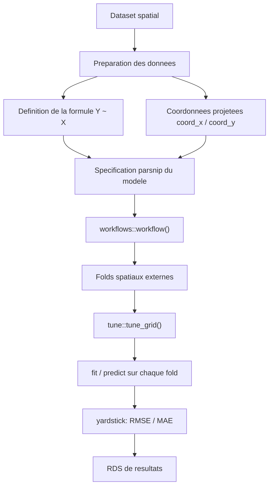

# Etat du pipeline `workflow()` / `tune_grid()` pour estimateurs spatiaux

Ce document synthetise l'etat actuel du travail d'integration de plusieurs
estimateurs spatiaux dans un pipeline R base sur `tidymodels`, `parsnip`,
`workflows`, `rsample`, `tune` et `yardstick`.

L'objectif general est de pouvoir comparer des modeles spatiaux et non
spatiaux sur des jeux de donnees geographiques, avec une validation croisee
spatiale externe et des metriques comparables.

## Resume

Le pipeline cible (formule -> `workflow()` -> `tune_grid()` -> sorties R de
resultats) est desormais **operationnel de bout en bout**, y compris la route
native `tune::tune_grid()` pour les deux moteurs `parsnip` custom
(`spboost_reg()`, `mgwrsar_reg()`). Le blocage qui empechait `tune_grid()` de
fonctionner (voir "Historique du blocage" plus bas) a ete identifie et
corrige le 2026-07-04. Un second bug, independant, a ete decouvert et corrige
dans la foulee : `spboost` echouait sur des jeux de donnees comportant des
predicteurs binaires (0/1).

Le pipeline a ete valide de bout en bout sur plusieurs jeux de donnees, avec
des modeles natifs `tidymodels`, des wrappers `parsnip` custom et, depuis le
2026-07-06, des estimateurs spatiaux externes scores directement fold par
fold quand ils ne rentrent pas encore proprement dans `parsnip`.

## Mise a jour courte au 2026-07-06

Le niveau actuel n'est plus seulement "faire marcher `workflow()` /
`tune_grid()`". Cette partie est acquise pour `spboost` et `mgwrsar`. Le
travail est maintenant dans une phase d'elargissement du benchmark spatial :
ajout de baselines ML, factorisation de la matrice de voisinage `W`, et
integration progressive d'estimateurs spatiaux qui ne sont pas encore tous
des moteurs `parsnip` complets.

Ce qui est en place :

- `glm`, `earth`, `earth_xy`, `random_forest`, `random_forest_xy`, `xgboost`,
  `xgboost_xy`, `gam_spatial`, `spboost`, `mgwrsar`, `mgwrsar_sar`,
  `mgwrsar_multiscale` ;
- `sar_lag` via `spatialreg::lagsarlm()` ;
- `sem_error` via `spatialreg::errorsarlm()` ;
- `sdm_mixed` via `spatialreg::lagsarlm(type = "mixed")` ;
- `mgwrsar_autocorr` via `mgwrsar::MGWRSAR(Model = "MGWRSAR_1_0_kv")` avec
  `control(W = W)` ;
- `spmoran_esf` via `spmoran::meigen()`/`meigen_f()` + `spmoran::esf()` ;
- `spmoran_resf` via `spmoran::resf()`, mais avec des predictions `NA` sur
  certains folds, donc statut experimental.

La matrice de voisinage `W` est maintenant factorisee dans
`Code_scrapping/R/utils/spatial_weights.R`. Le meme point de construction
sert a `spboost`, `mgwrsar`, `spatialreg` et au diagnostic Moran. Cela evite
que chaque wrapper construise une version legerement differente du voisinage.

L'indice de Moran est integre comme **diagnostic**, pas comme filtre
automatique. Autrement dit, on peut l'utiliser pour documenter
l'autocorrelation de `y` ou des residus, mais il ne decide pas tout seul quels
modeles lancer. Cette decision garde le benchmark comparable entre datasets :
la liste d'estimateurs est choisie explicitement, pas modifiee par un test
prealable.

Les sorties ne sont plus pensees comme des CSV principaux. Les resultats de
benchmark, les resumes agreges, les grilles de tuning et les manifestes de
resampling sont sauvegardes en `.rds`, c'est-a-dire en objets R natifs. Les
figures continuent d'etre generees par `spatial_viz.R`, qui doit lire les
sorties `.rds`.

## Objectif vise

Le pipeline cible est le suivant :



Ce pipeline fonctionne desormais tel quel :

```r
workflow() |>
  add_formula(mean_inc ~ sub18 + PER_PRV_SC + coord_x + coord_y) |>
  add_model(spec_modele_tunable) |>
  tune_grid(resamples = folds_spatiaux, grid = grille)
```

Ce point reste central : la validation croisee reste externe aux
estimateurs. Les wrappers `parsnip` n'embarquent aucune logique de CV
interne ; les folds spatiaux (near-prediction, bloc spatial) sont construits
a part et injectes dans `tune_grid()`/`fit_resamples()`.

## Fichiers concernes

- `Code_scrapping/R/estimators/benchmark_manual_test_2026-07.R` -- script pilote
- `Code_scrapping/R/estimators/parsnip_spboost.R` -- moteur parsnip custom SpBoost
- `Code_scrapping/R/estimators/parsnip_mgwrsar.R` -- moteur parsnip custom MGWRSAR/GWR
- `Code_scrapping/R/utils/hyperparam_tuning.R` -- tuning via `tune_grid()` + fallback
- `Code_scrapping/R/utils/spatial_cv.R` -- folds near-prediction et bloc spatial
- `Code_scrapping/R/utils/spatial_weights.R` -- construction factorisee de `W`,
  objets `listw` pour `spatialreg` et diagnostic Moran

Tous les commentaires ajoutes dans ces scripts sont en francais.

## Jeux de donnees integres et valides

| Dataset | N (apres `complete.cases()`) | Y | X | Statut |
|---|---:|---|---|---|
| `georgia` | 159 | `PctBach` | `PctRural+PctFB+PctBlack+PctEld` | valide, conforme a la fiche wiki |
| `ewhp` | 519 | `PurPrice` | `BldIntWr+BldPostW+Bld60s+Bld70s+Bld80s+TypDetch+TypSemiD+TypFlat+FlrArea` | valide, formule corrigee le 2026-07-04 (voir plus bas) |
| `nyc_education` | 2216 | `mean_inc` | `sub18+PER_PRV_SC+YOUTH_DROP+HS_DROP+COL_DEGREE+SCHOOL_CT` | valide, formule corrigee le 2026-07-04 |
| `lasrosas` | -- | `yield` | `nitro+bv` (formule simplifiee, ecart documente) | integre au registre, relance complete tres lente sur `mgwrsar_multiscale` |

### Correction des formules (2026-07-04)

En comparant le registre `DATASETS` du script pilote avec les fiches wiki de
reference (`wiki/datasets/packages/*.md`, champ `formula_pub` -- la formule
issue de la publication source verifiee pour chaque dataset), deux ecarts non
documentes ont ete trouves et corriges :

- **`ewhp`** : les trois variables categorielles `TypDetch`/`TypSemiD`/`TypFlat`
  (type de logement) etaient absentes du registre alors qu'elles font partie
  de la formule publiee et sont bien presentes dans le `.rds` final (0 % de
  valeurs manquantes).
- **`nyc_education`** : la variable cible utilisee etait `YOUTH_DROP` avec un
  jeu de predicteurs different de celui documente. La formule publiee (source :
  arxiv.org/pdf/2212.05814) utilise `mean_inc` comme cible.

Le seul ecart restant (`lasrosas`) est **intentionnel et documente en
commentaire dans le code** : la formule canonique utilise des noms de
variables transformees par GeoDa qui n'existent pas dans le `.rds` brut issu
d'`agridat`. Une formule numerique simplifiee est utilisee a la place pour ce
premier passage de validation.

## Preparation des donnees

1. lecture du fichier `.rds` final ;
2. conversion ou reprojection en CRS metrique ;
3. extraction de deux colonnes de coordonnees standardisees (`coord_x`,
   `coord_y`) ;
4. filtrage des lignes incompletes avec `complete.cases()` ;
5. construction de la formule de regression.

Les coordonnees sont volontairement ajoutees dans la formule pour les modeles
spatiaux custom, afin que `workflows` les conserve jusqu'au wrapper. Les
wrappers les retirent ensuite de la formule envoyee au backend statistique :
elles servent a calculer les distances ou la matrice de poids, pas comme
covariables ordinaires.

## Modeles compares

| Nom dans le pipeline | Backend R | Route `tune_grid()` native |
|---|---|---|
| `glm` | `stats::glm()` via `parsnip::linear_reg()` -- **c'est le baseline "OLS simple"** | oui (modele natif parsnip) |
| `earth` | `parsnip::mars()` via engine `earth`, baseline ML non spatiale (X seul) | oui (modele natif parsnip) |
| `earth_xy` | meme modele que `earth`, avec `coord_x`/`coord_y` comme covariables brutes | oui (modele natif parsnip) |
| `random_forest` | `parsnip::rand_forest()` via engine `ranger`, baseline ML non spatiale (X seul) | oui (modele natif parsnip) |
| `random_forest_xy` | meme modele que `random_forest`, avec `coord_x`/`coord_y` comme covariables brutes | oui (modele natif parsnip) |
| `xgboost` | `parsnip::boost_tree()` via engine `xgboost`, baseline ML non spatiale (X seul) | oui (modele natif parsnip) |
| `xgboost_xy` | meme modele que `xgboost`, avec `coord_x`/`coord_y` comme covariables brutes | oui (modele natif parsnip) |
| `gam_spatial` | `mgcv` via `parsnip::gen_additive_mod()` | non -- exception volontaire, voir ci-dessous |
| `spboost` | `spboost::spbgam()` via wrapper custom | **oui, depuis le 2026-07-04** |
| `mgwrsar` | `mgwrsar::MGWRSAR(Model="GWR")` -- une seule bande passante pour toutes les covariables -- **c'est le baseline "GWR simple"** | **oui, depuis le 2026-07-04** |
| `mgwrsar_sar` | `mgwrsar::MGWRSAR(Model="SAR")`, ajoute le 2026-07-04, baseline SAR global (lambda constant, beta constant, W construite par kNN k=8) | oui (memes rouages que `mgwrsar`) |
| `mgwrsar_multiscale` | `mgwrsar::TDS_MGWR(Model="tds_mgwr")` -- **une bande passante par covariable**, trouvee par backfitting | non applicable (pas d'hyperparametre externe a tuner, l'algorithme est auto-suffisant) |
| `sar_lag` | `spatialreg::lagsarlm()` | non -- score direct fold par fold |
| `sem_error` | `spatialreg::errorsarlm()` | non -- score direct fold par fold |
| `sdm_mixed` | `spatialreg::lagsarlm(type="mixed")` | non -- score direct fold par fold |
| `mgwrsar_autocorr` | `mgwrsar::MGWRSAR(Model="MGWRSAR_1_0_kv", control=list(W=W))` | oui pour `H`/`kernel` via la route MGWRSAR existante |
| `spmoran_esf` | `spmoran::esf()` avec vecteurs propres de Moran | non -- score direct fold par fold |
| `spmoran_resf` | `spmoran::resf()` avec effet spatial aleatoire | non -- experimental, predictions parfois `NA` |

Les baselines "OLS simple"/"GWR simple" demandees par l'utilisateur (2026-07-04)
etaient donc deja couvertes par `glm`/`mgwrsar` -- seuls `mgwrsar_sar` et
`xgboost` sont de vrais ajouts. Details d'implementation (construction de W,
attachement `library(mgwrsar)` requis pour le solveur SAR interne) dans
[[mgwrsar]].

`gam_spatial` reste ajuste par `parsnip::fit()` direct plutot que par
`workflow()` : l'usage de `mgcv::s()` dans la formule est mal prepare par le
chemin `workflow()` dans ce cas precis. Ce n'est pas lie au probleme
`tune_grid()` resolu ci-dessous ; `gam_spatial` n'a pas d'hyperparametre a
tuner dans cette passe (le lissage `s()` est choisi automatiquement par
`mgcv`).

### `mgwrsar` vs `mgwrsar_multiscale` -- "vrai" MGWR (ajoute le 2026-07-04)

Jusqu'ici, le seul mode `mgwrsar` du pipeline utilisait `Model="GWR"`, c'est-a-dire
**une seule bande passante `H` pour toutes les covariables**. Ce n'est pas le
MGWR multiscale au sens de Fotheringham et al. (2017) ni le MGWR-SAR de
Geniaux & Martinetti (2018, *Regional Science and Urban Economics*), qui
autorisent une bande passante differente par covariable (et, pour MGWR-SAR,
un coefficient d'autocorrelation spatiale lui-meme constant ou variable).
Le papier montre que le GWR simple est particulierement fragile des qu'une
covariable est elle-meme spatialement correlee (biais severe sur l'intercept
et cette covariable, par concurvite) -- un cas frequent en pratique.

`mgwrsar_multiscale` appelle `mgwrsar::TDS_MGWR(Model="tds_mgwr")`, qui
implemente l'algorithme du papier "Top-down scale approaches for multiscale
GWR" (Geniaux, *Journal of Geographical Systems*, 2026) : une sequence de
bandes passantes decroissantes testee par backfitting, convergeant vers une
bande passante propre a chaque covariable. Verifie sur `georgia` : les
bandes passantes retenues different fortement d'une covariable a l'autre
(ex. `PctFB` obtient H=14 quand les autres covariables restent quasi
globales, H≈127≈n) -- confirmant que le modele detecte reellement une
heterogeneite locale sur certaines variables et pas d'autres. Sur ce meme
dataset, `mgwrsar_multiscale` bat `mgwrsar` (GWR simple) sur les 3 schemas de
CV (RMSE holdout 2.766 vs 2.811, near-prediction 3.045 vs 3.140, bloc
spatial 3.293 vs 3.526).

Depuis le 2026-07-06, une premiere variante avec autocorrelation spatiale est
cablee : `mgwrsar_autocorr`, basee sur
`Model = "MGWRSAR_1_0_kv" + control(W = W)`. Cela ne ferme pas toute la
famille MGWR-SAR : il reste a documenter et tester plus proprement les choix
`kc/kv` selon les covariables fixes ou variables, mais le point bloquant
"comment fournir W au modele" est leve.

## Validation croisee spatiale

1. **Holdout 10 %** -- split simple train/test.
2. **Near-prediction CV** -- schema spatial inspire du code de reference de
   l'encadrant : le domaine est decoupe en cellules quadtree, puis un point
   test est tire par cellule (approximation batchee d'un LOOCV spatial).
3. **Spatial block CV** -- blocs spatiaux non hexagonaux via `blockCV`,
   convertis en `rsample::manual_rset()`.

Les deux schemas spatiaux retournent des objets `rsample` standards,
injectables directement dans `fit_resamples()` ou `tune_grid()`.

## Matrice de voisinage W

La construction de `W` est maintenant factorisee dans
`Code_scrapping/R/utils/spatial_weights.R`.

Pour `spboost` et `mgwrsar`, une matrice de poids spatiaux `W` est construite
ainsi :

1. matrice k-plus-proches-voisins a partir de `coord_x`/`coord_y` ;
2. standardisation par ligne avec `mgwrsar::normW()` ;
3. conversion en objet `Matrix` (S4) quand le backend l'exige.

Pour `spatialreg`, la meme logique kNN est convertie en objet `listw` via
`spdep::knearneigh()`, `spdep::knn2nb()` et `spdep::nb2listw()`, car
`lagsarlm()`/`errorsarlm()` attendent un voisinage `spdep` et pas une matrice
dense brute.

Pour `mgwrsar` (`Model = "GWR"`), aucune matrice `W` explicite n'est
construite ; le modele utilise coordonnees, bande passante `H` et noyau
`kernels` directement. Pour `mgwrsar_sar` et `mgwrsar_autocorr`, `W` est
construite explicitement et passee au backend.

Deux niveaux de `W` existent pendant les predictions spatiales :

- `W` sur l'entrainement, utilisee au fit ;
- `W_full` ou `listw_all` sur train+test, utilisee quand le backend a besoin
  d'un voisinage incluant les nouvelles observations.

**Aucune matrice de voisinage officielle** (`.gal`/`.gwt`/`.swm`) n'a ete
trouvee dans les exports des datasets utilises -- ni dans les `.rds` finaux,
ni en fichier auxiliaire aupres des sources. Si une matrice officielle est
retrouvee plus tard, il faudra garantir le meme ordre de lignes que le
dataset final, le meme filtrage post-`complete.cases()`, et des sous-matrices
coherentes par split train/test.

## Historique du blocage `tune_grid()` (resolu le 2026-07-04)

### Symptome

`tune::tune_grid()` echouait pour les deux moteurs custom des qu'un
hyperparametre etait marque `tune::tune()` dans la spec, avec le message :

```text
il faut un objet avec une composante call
```

`tune_grid()` detectait pourtant correctement le parametre a tuner
(`mstop` pour SpBoost, `bandwidth` pour MGWRSAR, confirme via
`tune::extract_parameter_set_dials()`), et l'echec survenait **avant**
l'appel a nos fonctions de fit (`spboost_fit_impl()`/`mgwrsar_fit_impl()`),
ce qui rendait le diagnostic difficile : aucune trace ajoutee dans ces
fonctions ne s'affichait.

### Cause racine

`tune_grid()` finalise chaque candidat de la grille en appelant
`update(spec, parameters = <valeurs>)` sur la specification `parsnip`. Or les
moteurs `spboost_reg()`/`mgwrsar_reg()` n'avaient jamais defini de methode
`update.spboost_reg()`/`update.mgwrsar_reg()`. R retombe alors sur
`stats::update.default()`, qui exige un champ `$call` -- absent de nos
specs -- d'ou l'erreur.

C'est un point precis et documente de l'ecriture d'un nouveau modele
`parsnip` : chaque modele custom doit fournir sa propre methode `update.*()`
pour etre compatible avec `tune_grid()`.

### Correctif

Ajout d'une methode `update.spboost_reg()` et `update.mgwrsar_reg()` dans les
fichiers de moteur respectifs, suivant exactement le patron interne utilise
par `parsnip` pour ses propres modeles (`parsnip:::update.linear_reg()`,
`parsnip:::update.gen_additive_mod()`), en deleguant a l'utilitaire interne
non exporte `parsnip:::update_spec()`.

Verification : test minimal (2 folds x 2 valeurs de grille) sur les deux
moteurs, puis execution complete du pipeline sur les trois datasets -- 0
erreur, `tune_grid()` natif utilise partout (voir "Resultats" plus bas).

## Bug secondaire decouvert et corrige : predicteurs binaires dans SpBoost

En corrigeant la formule `ewhp` (ajout de 3 variables 0/1), un nouveau
probleme est apparu, independant du blocage `tune_grid()` : `spboost`
(via `mboost::gamboost()` en interne) attribue par defaut un lisseur
P-spline (`bbs()`) a **chaque** predicteur numerique d'une formule, y
compris les variables binaires. Un lisseur P-spline sur seulement deux
valeurs distinctes produit une base de fonctions rank-deficiente, ce qui
fait planter le solveur lineaire interne (`Lapack dgesv : systeme
exactement singulier`).

Verification faite : ce bug preexistait meme avec l'ancienne formule `ewhp`
(5 variables binaires + 1 continue), qui n'avait simplement jamais ete
executee avec `spboost` avant cette passe -- ce n'est donc pas une
consequence de la correction de formule, mais un probleme latent revele par
elle.

**Correctif** : une nouvelle fonction `spb_build_boosting_formula()` route
chaque predicteur vers `bols()` (terme lineaire) s'il n'a que deux valeurs
distinctes dans les donnees d'entrainement du fold courant, sinon vers
`bbs()` (lissage). C'est un patron standard en boosting/GAM pour des
covariables melangees continues/binaires. Un `library(mboost)` explicite a
aussi ete necessaire pour que `gamboost()` resolve `bbs()`/`bols()` au
moment de l'evaluation de la formule (le binding par environnement de
formule, qui fonctionne pour `mgcv::s()`, ne fonctionne pas pour
`mboost::bbs()`/`bols()`).

## Robustesse du fallback de tuning

A l'occasion du bug ci-dessus, un trou de gestion d'erreur a egalement ete
corrige dans `fit_static_grid_resamples()` (le mecanisme de repli utilise si
`tune_grid()` echoue) : si **tous** les folds d'un candidat echouaient au
fit, `tune::collect_metrics()` levait une erreur non rattrapee qui
interrompait tout le pipeline au lieu de marquer ce seul candidat comme
echoue. Le correctif englobe desormais l'intégralite du bloc fit + collecte
dans un seul `tryCatch()`.

## Tuning des hyperparametres

### SpBoost

- `mstop` (nombre d'iterations de boosting) : **tune** via grille externe,
  actuellement `50, 100, 200, 300, 400, 600, 800, 1000`
- `nu` (taux d'apprentissage) : fixe pour l'instant
- `k_neighbors` (voisins pour `W`) : fixe pour l'instant

### MGWRSAR / GWR

- `bandwidth`/`H` : **tune** via grille externe
- `kernels` : teste explicitement dans une boucle (moins robuste dans
  `tune_grid()` que les parametres numeriques)
- grille `H` actuelle : `10, 20, 30, 40, 60, 80, 100, 150, 200`

Chaque candidat de grille est evalue par validation near-prediction. Un
diagnostic anti-"piege geoadditif" (comparaison de `rho_hat` estime et de
l'indice de Moran des residus filtres) est disponible pour SpBoost, pour
detecter les cas ou l'augmentation de `mstop` ameliore le RMSE en absorbant
silencieusement le signal spatial plutot qu'en l'expliquant -- aucun cas de
ce type n'a ete observe sur les trois datasets valides.

## Resultats (course complete, 2026-07-04)

Pipeline execute sans erreur sur les trois datasets, RMSE holdout (10 %) par
modele :

| Dataset | glm | gam_spatial | spboost | mgwrsar |
|---|---:|---:|---:|---:|
| `georgia` (N=159) | 2.960 | 2.847 | 3.225 | **2.811** |
| `ewhp` (N=519) | 27 724 | 20 634 | **19 605** | 26 499 |
| `nyc_education` (N=2216) | 14 644 | 14 006 | **12 230** | 13 302 |

Meilleurs hyperparametres retenus (near-prediction, `tune_grid()` natif) :

| Dataset | SpBoost `mstop` | MGWRSAR `H` / `kernel` |
|---|---:|---|
| `georgia` | 50 | 30 / gauss |
| `ewhp` | 50 | 10 / gauss |
| `nyc_education` | 400 | 30 / gauss |

Aucun modele ne domine systematiquement les trois datasets, ce qui est
attendu a ce stade (formules simplifiees, grilles de tuning volontairement
compactes pour une premiere passe). Le point important pour cette etape du
travail n'est pas la performance comparative des modeles, mais la validite
technique du pipeline lui-meme.

Fichiers de sortie :

- `data/manifests/runs/benchmark_manual_test_2026-07.rds`
- `data/manifests/runs/benchmark_manual_test_2026-07_summary.rds`
- `data/manifests/runs/resamples_<dataset>_2026-07.rds`
- `data/manifests/runs/hyperparam_tuning_<dataset>_spboost_mstop_2026-07.rds`
- `data/manifests/runs/hyperparam_tuning_<dataset>_spboost_mstop_2026-07_full.rds`
- `data/manifests/runs/hyperparam_tuning_<dataset>_mgwrsar_H_kernel_2026-07.rds`
- `data/manifests/runs/hyperparam_tuning_<dataset>_mgwrsar_H_kernel_2026-07_full.rds`

Chaque ligne de grille porte une colonne `tuning_method` indiquant
`"tune_grid"` (route native, cas actuel sur les trois datasets) ou
`"static_workflow_resamples"` (repli, conserve comme filet de securite mais
non declenche dans cette passe).

## Signification des messages A/B/C/D dans les logs

Les lettres `A`, `B`, `C`, `D` affichees par `tune` pendant l'execution ne
sont pas des familles statistiques : ce sont des etiquettes automatiques
regroupant les erreurs/warnings identiques (ex. `A: x45` = probleme `A`
survenu 45 fois). Utile pour lire les logs sans confusion, en particulier
les warnings benins (extrapolation lineaire sur bornes de spline) qui
n'indiquent pas un probleme bloquant.

## Ce qui reste ouvert

1. ~~`lasrosas` n'a pas encore ete relance avec les correctifs les plus
   recents~~ -- relance le 2026-07-04 avec l'ensemble complet des 7
   estimateurs (`run_manual_test(c("georgia","ewhp","lasrosas","nyc_education"))`),
   premier passage complet de ce dataset dans le pipeline. Tres lent sur
   `mgwrsar_multiscale` (backfitting `TDS_MGWR()` sur n~3443).
2. `nu` (SpBoost) et `k_neighbors` (construction de `W`) restent fixes ;
   seuls `mstop` et `bandwidth`/`kernels` sont tunes dans cette passe.
3. Pas de vraie recherche `dials` (bornes/echelles de parametres) : les
   grilles sont des vecteurs manuels passes directement a `tune_grid()`.
4. `gam_spatial` reste hors du chemin `workflow()` standard.
5. Aucune matrice de voisinage officielle retrouvee pour aucun dataset ; `W`
   est toujours reconstruite en kNN par les utilitaires communs.
6. ~~La documentation wiki des estimateurs ne mentionne pas encore ces
   nouveaux moteurs `parsnip`~~ -- fait le 2026-07-04, voir [[spboost]],
   [[mgwr]], [[mgwrsar]], [[xgboost]].
7. Les variantes MGWR-SAR *mixtes* plus fines restent a stabiliser. Ce qui
   EST cable depuis le 2026-07-06 : une premiere route
   `mgwrsar_autocorr` (`MGWRSAR_1_0_kv + control(W=W)`). Il reste a clarifier
   le choix theorique des covariables fixes/variables et a valider sur les
   grands datasets.
8. `atds_mgwr` (variante "boosting" de `tds_mgwr`, plus couteuse mais plus
   precise selon le papier top-down scale) n'a pas encore ete testee, seul
   `tds_mgwr` (stage 1 seul) est utilise dans `mgwrsar_multiscale`.
9. `spmoran_resf` est experimental : il s'ajuste et score certains folds, mais
   produit encore des predictions `NA` sur quelques splits. `spmoran_esf` est
   plus stable dans les tests rapides.
10. `spatialreg::predict.Sarlm()` est fragile en prediction hors-echantillon
    avec des folds train/test. Le pipeline utilise la prediction spatiale
    quand elle est acceptee, puis un repli de tendance lineaire quand
    `predict.Sarlm()` refuse le `listw` du split. Cette limite doit etre
    documentee si les resultats SAR/SEM/SDM sont presentes comme resultats
    scientifiques.

## Visualisations (ajoute le 2026-07-04, etendu le 2026-07-04)

Le script `Code_scrapping/R/utils/spatial_viz.R` genere les figures
habituelles des papiers d'econometrie spatiale consultes. Chaque dataset
ecrit desormais dans son propre sous-dossier
`data/manifests/runs/figures/<dataset_name>/`.

Figures a partir des RDS deja produits (aucune reexecution de modele) :

- courbe de calibration d'un hyperparametre (RMSE vs `mstop`/`bandwidth`,
  facon Fig. 5 du papier spboost) ;
- barres RMSE/MAE comparatives par (estimateur x schema de CV).

```r
generate_dataset_figures("georgia")
```

Cartes de coefficients locaux (REFIT GWR + MGWR multiscale sur l'ensemble du
dataset, plus couteux) :

```r
save_local_coefficient_maps("georgia")
```

Inspire de la Fig. 7 de arxiv:2212.05814 (papier source de `nyc_education`).
`data/final_datasets/sf` porte en fait deja la geometrie surfacique
d'origine dans la colonne `geom_origine` (masquee par defaut dans
`prep_dataset()`) : `georgia` (comtes) et `nyc_education` (census tracts)
sont en MULTIPOLYGON, confirme contre le shapefile
`libpysal.examples("georgia")` (meme `AreaKey`) -- la fonction produit donc
un vrai choropleth pour ces deux datasets, et un nuage de points colore pour
`ewhp`/`lasrosas` (observations individuelles sans polygone d'origine).
Chaque covariable recoit sa propre echelle de couleur divergente (assemblage
`patchwork`), pour ne pas ecraser les covariables a faible amplitude a cote
d'une covariable a forte amplitude.

Hors scope pour l'instant : diagnostic de perturbation de W selon le schema
de CV (Fig. 2 du papier spboost).

## Commandes manuelles utiles

Depuis la racine du repo :

```r
setwd("Code_scrapping")
source("R/estimators/benchmark_manual_test_2026-07.R")
out <- run_manual_test(c("georgia", "ewhp", "nyc_education"))
```

Pour lancer seulement quelques estimateurs et eviter un benchmark complet :

```r
setwd("Code_scrapping")
source("R/estimators/benchmark_manual_test_2026-07.R")
out <- run_manual_test(
  c("georgia"),
  estimators = c("sar_lag", "sem_error", "sdm_mixed",
                 "mgwrsar_autocorr", "spmoran_esf", "spmoran_resf")
)
```

Pour calculer un diagnostic Moran sur un dataset prepare :

```r
setwd("Code_scrapping")
source("R/estimators/benchmark_manual_test_2026-07.R")
df <- prep_dataset(DATASETS[["nyc_education"]])
moran_i_knn(
  df[[DATASETS[["nyc_education"]]$y]],
  as.matrix(df[, c("coord_x", "coord_y")])
)
```

Pour tester seulement le chargement et la preparation d'un dataset :

```r
setwd("Code_scrapping")
source("R/estimators/benchmark_manual_test_2026-07.R")
df <- prep_dataset(DATASETS[["nyc_education"]])
nrow(df)   # 2216
```

Pour verifier que `tune_grid()` natif fonctionne sur un moteur donne :

```r
sp_spec <- spboost_reg(coords = c("coord_x","coord_y"), DGP = "SAR",
                        mstop = tune::tune(), nu = 0.1, k_neighbors = 8) |>
  parsnip::set_engine("spboost") |> parsnip::set_mode("regression")
wf <- make_formula_workflow(sp_spec, mean_inc ~ sub18 + PER_PRV_SC + coord_x + coord_y)
tune::extract_parameter_set_dials(wf)   # doit lister "mstop"
res <- tune::tune_grid(wf, resamples = rset, grid = data.frame(mstop = c(50L, 100L)))
tune::show_notes(res)   # doit dire "Great job! No notes to show." (ou juste des warnings benins)
```

## Conclusion

L'architecture cible est en place et validee de bout en bout :

- preparation de datasets spatiaux, formules alignees sur les fiches
  documentees ;
- generation de folds spatiaux externes (near-prediction, bloc spatial) ;
- wrappers `parsnip` custom pour `spboost` et `mgwrsar`, avec route native
  `tune::tune_grid()` fonctionnelle (et un fallback robuste conserve en
  filet de securite) ;
- evaluation par RMSE/MAE, sauvegarde en objets R `.rds` ;
- execution complete sans erreur sur trois datasets de tailles differentes
  (159, 519, 2216 observations).

Le point bloquant identifie dans la version precedente de ce document
(`tune_grid()` non fonctionnel) est resolu. Le travail restant est
d'elargissement et de stabilisation scientifique : comparer plus
d'estimateurs, valider la prediction hors-echantillon des modeles spatiaux
classiques, documenter `W`, et decider quels resultats sont assez solides
pour etre presentes au superviseur.

## Related Pages

- [[r_estimator_implementation_policy_v1]]
- [[restricted_estimator_policy_v1]]
- [[spboost]]
- [[mgwrsar]]
- [[mgwr]]
